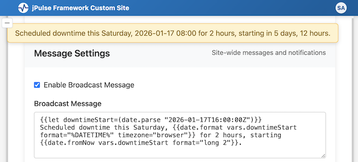

# jPulse Docs / Handlebars Templating v1.6.4

The jPulse Framework uses server-side Handlebars templating to create dynamic web pages. This document provides a comprehensive guide to using Handlebars in your jPulse applications.

**🎯 Live Examples:** See the [Handlebars Examples](/jpulse-examples/handlebars.shtml) page, which provides interactive examples with source code for all the concepts covered in this guide.

## Overview

Handlebars is a semantic templating language that allows you to build dynamic HTML pages by embedding expressions within your templates. The jPulse Framework processes these templates server-side, so the browser receives fully rendered HTML.

There are two types of handlebars:
- **Regular handlebars**: Single-line expressions that output values or perform operations, such as `{{user.firstName}}`, `{{and a b}}`
- **Block handlebars**: Multi-line expressions with opening and closing tags that control flow and rendering, such as `{{#if condition}}...{{/if}}`, `{{#each items}}...{{/each}}`

**Note:** Vue.js supports browser-side handlebars with a slightly different syntax, such as `{{ order.id }}`. For details, see [Template Reference - Vue.js Templates](template-reference.md#vuejs-templates-client-side-only).

### Type System

Handlebars helpers in jPulse use a native type system for internal processing while maintaining string-based template output:

**Native Types in Subexpressions:**
- Boolean helpers (`eq`, `and`, `includes`, `isEmpty`, etc.) return native `true` or `false`
- Numeric helpers (`math.*`, `array.length`) return native numbers
- Array helpers (`file.list`) and `json.parse` return native arrays/objects
- Native types are preserved through nested subexpressions

**String Output for Display:**
- At the final rendering stage, non-string values are automatically converted:
  - Booleans: `true` → `"true"`, `false` → `"false"`
  - Numbers: `42` → `"42"`
  - Arrays/Objects: `["a","b"]` → `'["a","b"]'` (JSON.stringify)
  - `null`/`undefined`: → `""` (empty string)

**Practical Examples:**

```handlebars
<!-- Boolean helpers return native boolean -->
{{#if (eq user.role "admin")}}         <!-- Works: native true/false -->
    Admin panel
{{/if}}

<!-- Numeric helpers return native numbers -->
{{#if (gt (math.add 5 3) 7)}}          <!-- Works: native 8 > 7 -->
    Greater than 7
{{/if}}

<!-- Array helpers work with native arrays -->
{{let myArray=(json.parse '["a","b","c"]')}}
{{array.length vars.myArray}}          <!-- Displays: "3" -->
{{#if (array.includes vars.myArray "b")}} <!-- Works: native boolean -->
    Contains "b"
{{/if}}

<!-- Final output is always stringified -->
Result: {{eq 1 1}}                      <!-- Displays: "true" -->
Length: {{array.length items}}          <!-- Displays: "5" -->
```

**Why This Matters:**
- Correct boolean evaluation in conditionals (avoids string "false" being truthy)
- Efficient data passing between helpers without repeated parsing
- Type-safe operations with proper coercion

### Summary of Regular Handlebars

%DYNAMIC{handlebars-list-table type="regular"}%

<!-- Regular handlebars as of v1.3.17: (above dynamic list shows the current list)
| Regular Handlebars with Examples | What it does |
|----------------------------------|--------------|
| `{{and user.isAuthenticated user.isAdmin}}` | Logical AND, returns "true" or "false" (1+ arguments) |
| `{{app.site.name}} v{{app.site.version}}` | Application context (app.jPulse.*, app.site.*) |
| `{{appCluster.*}}` | Redis cluster availability information |
| `{{appConfig.*}}` | Full application configuration (filtered based on auth) |
| `{{components.jpIcons.configSvg size="64"}}` | Reusable component call with parameters |
| `{{eq user.role "admin"}}` | Equality comparison, returns "true" or "false" (2 arguments) |
| `{{file.include "template.tmpl"}}` | Include another template file |
| `{{file.exists "file.tmpl"}}` | Check if file exists, returns "true" or "false" |
| `{{file.list "admin/*.shtml"}}` | List files matching glob pattern |
| `{{file.timestamp "file.css"}}` | Get file last modified timestamp |
| `{{gt user.score 100}}` | Greater than comparison, returns "true" or "false" (2 arguments) |
| `{{gte user.count 10}}` | Greater than or equal comparison, returns "true" or "false" (2 arguments) |
| `{{i18n.view.home.introduction}}` | Internationalization messages from translation files |
| `{{let pageTitle="Dashboard" maxItems=10}}` | Define custom variables (accessed via `{{vars.*}}`) |
| `{{lt user.age 18}}` | Less than comparison, returns "true" or "false" (2 arguments) |
| `{{lte user.items 5}}` | Less than or equal comparison, returns "true" or "false" (2 arguments) |
| `{{ne user.role "guest"}}` | Not equal comparison, returns "true" or "false" (2 arguments) |
| `{{not user.isGuest}}` | Logical NOT, returns "true" or "false" (1 argument) |
| `{{or user.isPremium user.isTrial}}` | Logical OR, returns "true" or "false" (1+ arguments) |
| `{{siteConfig.email.adminEmail}}` | Site configuration values from ConfigModel (database) |
| `{{url.protocol}}://{{url.hostname}}{{url.pathname}}` | URL context (protocol, hostname, port, pathname, search, domain, param.*) |
| `{{user.firstName}} {{user.email}}` | User context (username, loginId, firstName, lastName, email, roles, isAuthenticated, isAdmin) |
| `{{vars.pageTitle}}` | Custom variables defined with `{{let}}` or `{{#let}}` |
-->

### Summary of Block Handlebars

%DYNAMIC{handlebars-list-table type="block"}%

<!-- Block handlebars as of v1.3.17: (above dynamic list shows the current list)
| Block Handlebars with Examples | What it does |
|--------------------------------|--------------|
| `{{#and user.isAuthenticated user.isAdmin}} admin {{else}} not admin {{/and}}` | Logical AND block, renders true or else part (1+ arguments) |
| `{{#component "widgets.button" text="Click"}}...{{/component}}` | Define reusable component with parameters |
| `{{#each users}}...{{/each}}` | Iterate over array or object properties |
| `{{#eq user.status "active"}} active {{else}} inactive {{/eq}}` | Equality block, renders true or else part (2 arguments) |
| `{{#gt user.score 100}} high score {{else}} low score {{/gt}}` | Greater than block, renders true or else part (2 arguments) |
| `{{#gte user.count 10}} enough {{else}} not enough {{/gte}}` | Greater than or equal block, renders true or else part (2 arguments) |
| `{{#if user.isAuthenticated}} welcome {{else}} login {{/if}}` | Conditional rendering based on truthy value |
| `{{#let inner="inner"}}...{{/let}}` | Block-scoped custom variables (accessed via `{{vars.*}}`) |
| `{{#lt user.age 18}} minor {{else}} adult {{/lt}}` | Less than block, renders true or else part (2 arguments) |
| `{{#lte user.items 5}} few items {{else}} many items {{/lte}}` | Less than or equal block, renders true or else part (2 arguments) |
| `{{#ne user.role "guest"}} registered {{else}} guest {{/ne}}` | Not equal block, renders true or else part (2 arguments) |
| `{{#not user.isGuest}} registered {{else}} guest {{/not}}` | Logical NOT block, renders true or else part (1 argument) |
| `{{#or user.isPremium user.isTrial}} limited {{else}} full {{/or}}` | Logical OR block, renders true or else part (1+ arguments) |
| `{{#unless user.isAuthenticated}} login {{else}} welcome {{/unless}}` | Inverse conditional rendering (when condition is false) |
| `{{#with user}} {{firstName}} {{lastName}} {{/with}}` | Switch context to object's properties |
-->
## Context Variables

The jPulse Framework provides several context objects that are available in all templates:

### `{{app.*}}` - Application Context

- `{{app.jPulse.name}}` - jPulse Framework application name
- `{{app.jPulse.version}}` - Current jPulse Framework application version
- `{{app.jPulse.release}}` - Current jPulse Framework application release date
- `{{app.site.name}}` - Custom site name
- `{{app.site.version}}` - Current site version
- `{{app.site.release}}` - Current site release date
- `{{app.site.copyright}}` - Custom site copyright notice

### `{{appCluster.*}}` - Redis Cluster Information

Redis cluster availability information.

### `{{appConfig.*}}` - Application Configuration

Full application configuration (filtered based on auth).

### `{{i18n.*}}` - Internationalization

- `{{i18n.view.home.*}}` - Home page messages
- `{{i18n.view.home.introduction}}` - Introduction message
- `{{i18n.view.auth.*}}` - Authentication messages
- `{{i18n.controller.*}}` - Controller messages
- `{{i18n.*}}` - Consult the translation files at webapp/translations/ for available fields

### `{{siteConfig.*}}` - Site Configuration

- `{{siteConfig.email.adminEmail}}` - Administrator email address
- `{{siteConfig.*}}` - Consult webapp/model/config.js for available fields

### `{{url.*}}` - URL Context

- `{{url.protocol}}` - HTTP or HTTPS
- `{{url.hostname}}` - Domain name
- `{{url.port}}` - Port number
- `{{url.pathname}}` - URL path
- `{{url.search}}` - Query string
- `{{url.domain}}` - Full domain with port
- `{{url.param.name}}` - Query parameters (replace 'name' with parameter name)

### `{{user.*}}` - User Context

- `{{user.username}}` - User's username
- `{{user.loginId}}` - User's loginId
- `{{user.firstName}}` - User's first name
- `{{user.nickName}}` - User's nickname
- `{{user.lastName}}` - User's last name
- `{{user.initials}}` - User's initials
- `{{user.email}}` - User's email address
- `{{user.roles}}` - JSON array of user roles
- `{{user.isAuthenticated}}` - Login status (true/false)
- `{{user.isAdmin}}` - Admin status (true/false)

### `{{vars.*}}` - Custom Variables

User-defined custom variables (see [Custom Variables](#custom-variables) section). Custom variables are defined using `{{let}}` or `{{#let}}` and accessed via `{{vars.*}}`.

> **Note:** System context variables (`app`, `user`, `url`, `config`, `i18n`) are protected and cannot be overridden by custom variables.

## Regular Helpers

### Logical Helpers

#### `{{and}}` - Logical AND

Returns `"true"` if all arguments are truthy (1+ arguments), otherwise returns `"false"`.

```handlebars
{{and user.isAuthenticated user.isAdmin}}        <!-- Returns "true" or "false" -->
```

**Usage in subexpressions:**
```handlebars
{{#if (and user.isAdmin user.isActive)}}
    Active admin!
{{/if}}
```

**Type Coercion:**
- Numbers and numeric strings are compared numerically: `{{gt "10" 5}}` → `"true"`
- Strings are compared lexicographically: `{{gt "2025-12-14" "2025-12-13"}}` → `"true"`
- Loose equality for comparisons: `{{eq 1 "1"}}` → `"true"`

#### `{{not}}` - Logical NOT

Returns `"true"` if argument is falsy (exactly 1 argument), otherwise returns `"false"`.

```handlebars
{{not user.isGuest}}                      <!-- Returns "true" or "false" -->
```

**Usage in subexpressions:**
```handlebars
{{#if (not user.isGuest)}}
    Registered user
{{/if}}
```

#### `{{or}}` - Logical OR

Returns `"true"` if any argument is truthy (1+ arguments), otherwise returns `"false"`.

```handlebars
{{or user.isPremium user.isTrial}}        <!-- Returns "true" or "false" -->
```

**Usage in subexpressions:**
```handlebars
{{#if (or (eq user.role "admin") (and (gt user.score 1000) user.isPremium))}}
    Special access!
{{/if}}
```

### Comparison Helpers

#### `{{eq}}` - Equality comparison

Returns `"true"` if values are equal with type coercion (exactly 2 arguments), otherwise returns `"false"`.

```handlebars
{{eq user.role "admin"}}                  <!-- Returns "true" or "false" -->
```

**Usage in subexpressions:**
```handlebars
{{#if (eq user.status "active")}}
    User is active
{{/if}}
```

**Type Coercion:**
- Numbers and numeric strings are compared numerically: `{{gt "10" 5}}` → `"true"`
- Strings are compared lexicographically: `{{gt "2025-12-14" "2025-12-13"}}` → `"true"`
- Loose equality for comparisons: `{{eq 1 "1"}}` → `"true"`

#### `{{gt}}` - Greater than

Returns `"true"` if `a > b` with type coercion (exactly 2 arguments), otherwise returns `"false"`.

```handlebars
{{gt user.score 100}}                     <!-- Returns "true" or "false" -->
```

**Usage in subexpressions:**
```handlebars
{{#if (gt user.score 100)}}
    High score!
{{/if}}
```

**Type Coercion:**
- Numbers and numeric strings are compared numerically: `{{gt "10" 5}}` → `"true"`
- Strings are compared lexicographically: `{{gt "2025-12-14" "2025-12-13"}}` → `"true"`

#### `{{gte}}` - Greater than or equal

Returns `"true"` if `a >= b` with type coercion (exactly 2 arguments), otherwise returns `"false"`.

```handlebars
{{gte user.count 10}}                     <!-- Returns "true" or "false" -->
```

**Type Coercion:**
- Numbers and numeric strings are compared numerically
- Strings are compared lexicographically

#### `{{lt}}` - Less than

Returns `"true"` if `a < b` with type coercion (exactly 2 arguments), otherwise returns `"false"`.

```handlebars
{{lt user.age 18}}                        <!-- Returns "true" or "false" -->
```

**Usage in subexpressions:**
```handlebars
{{#unless (or (eq user.role "guest") (lt user.score 10))}}
    Regular user content
{{/unless}}
```

**Type Coercion:**
- Numbers and numeric strings are compared numerically
- Strings are compared lexicographically

#### `{{lte}}` - Less than or equal

Returns `"true"` if `a <= b` with type coercion (exactly 2 arguments), otherwise returns `"false"`.

```handlebars
{{lte user.items 5}}                      <!-- Returns "true" or "false" -->
```

**Type Coercion:**
- Numbers and numeric strings are compared numerically
- Strings are compared lexicographically

#### `{{ne}}` - Not equal

Returns `"true"` if values are not equal with type coercion (exactly 2 arguments), otherwise returns `"false"`.

```handlebars
{{ne user.role "guest"}}                  <!-- Returns "true" or "false" -->
```

**Type Coercion:**
- Numbers and numeric strings are compared numerically
- Strings are compared lexicographically
- Loose equality for comparisons: `{{eq 1 "1"}}` → `"true"`

### Component Helpers

#### `{{components.*}}` - Use Reusable Components

Call registered reusable components with parameters. See [Reusable Components](#reusable-components) section for details.

```handlebars
{{components.jpIcons.configSvg size="64"}}
{{components.widgets.buttonPrimary text="Submit" size="large"}}
```

**Naming convention:**
- Component names are converted from kebab-case to camelCase for usage
- `jpIcons.logs-svg` becomes `{{components.jpIcons.logsSvg}}`
- `cards.user-card` becomes `{{components.cards.userCard}}`

### File Operation Helpers

#### `{{file.exists}}` - Check file existence

Check if a file exists, returns `"true"` or `"false"`.

```handlebars
{{#if (file.exists "custom-template.tmpl")}}
    {{file.include "custom-template.tmpl"}}
{{else}}
    {{file.include "default-template.tmpl"}}
{{/if}}
```

#### `{{file.include}}` - Include template

Include another template file. You can define parameters, and use them in the included template.

```handlebars
{{file.include "jpulse-header.tmpl"}}
{{file.include "jpulse-navigation.tmpl"}}
{{file.include "my-own-stuff.tmpl" someKey="some value" sleepy=true}}
```

**Using parameters in included template:**
```handlebars
{{#if sleepy}}
    ...
{{else}}
    ...
{{/if}}
```

#### `{{file.includeComponents}}` - Include components from files

Register components from multiple files and make them available in the `components` context. This is particularly useful for dashboard pages that aggregate cards from multiple source files.

```handlebars
{{!-- Register all admin dashboard cards --}}
{{file.includeComponents "admin/*.shtml" component="adminCards.*"}}

{{!-- Render all registered cards --}}
{{#each components.adminCards}}
    {{this}}
{{/each}}
```

**Define components in source files** (e.g., `admin/config.shtml`):
```handlebars
{{#component "adminCards.config" order=10}}
    <a href="/admin/config.shtml" class="jp-card-dashboard jp-icon-btn">
        <div class="jp-icon-container">{{components.jpIcons.configSvg size="64"}}</div>
        <h3 class="jp-card-title">Configuration</h3>
        <p class="jp-card-description">Manage site configuration</p>
    </a>
{{/component}}
```

**Include components parameters:**
- `{{file.includeComponents "admin/*.shtml" component="adminCards.*" sortBy="component-order"}}`
- `"glob-pattern"`: File pattern to search, such as `"admin/*.shtml"` (required)
- `component="namespace.*"`: Filter components by namespace pattern (optional)
- `sortBy="method"`: Sort method (optional)
  - `"component-order"`: Sort by the `order=N` parameter in component definitions (default)
  - `"plugin-order"`: Sort by plugin dependency resolution order (for plugin dashboards)
  - `"filename"`: Alphabetical sorting by filename
  - `"filesystem"`: Natural filesystem order (no sorting)

**Example - Plugin Dashboard:**
```handlebars
{{!-- Register plugin cards sorted by dependency order --}}
{{file.includeComponents "jpulse-plugins/*.shtml" component="pluginCards.*" sortBy="plugin-order"}}

{{!-- Render plugin cards --}}
{{#each components.pluginCards}}
    {{this}}
{{/each}}
```

**Features:**
- **Silent registration:** Components are registered without output, then rendered via `{{#each}}`
- **Pattern filtering:** Use `component="namespace.*"` to register only specific namespaced components
- **Flexible sorting:** Choose sort method based on dashboard requirements
- **Component expansion:** Components are fully expanded (including nested components and i18n) before registration
- **Site overrides:** Automatically uses site overrides when available
- **Security:** Path traversal protection, errors logged server-side only

#### `{{file.list}}` - List files matching pattern

List files matching a glob pattern.

```handlebars
{{#each file.list "admin/*.shtml"}}
    <p>{{this}}</p>
{{/each}}
```

**With filename sorting:**
```handlebars
{{#each file.list "admin/*.shtml" sortBy="filename"}}
    <li>{{this}}</li>
{{/each}}
```

The `file.list` helper supports:
- Glob patterns: `"admin/*.shtml"`, `"docs/*.md"`, `"projects/*/*.shtml"` (supports multiple wildcards in path)
- **Note:** Recursive patterns (`**`) are not supported. Use single-level wildcards (`*`) only.
- **Multi-level patterns:** Patterns like `projects/*/*.shtml` work by recursively searching subdirectories
- Site overrides: Automatically searches `site/webapp/view/` first, then `webapp/view/`
- Sorting: `sortBy="filename"` (alphabetical)

#### `{{file.timestamp}}` - Get file timestamp

Get the last modified timestamp of a file.

```handlebars
{{file.timestamp "jpulse-footer.tmpl"}}
{{!-- Use the file timestamp for browser cache busting: --}}
<link rel="stylesheet" href="/jpulse-common.css?t={{file.timestamp "jpulse-common.css"}}">
```

### Variable Helpers

#### `{{let}}` - Define custom variables

Define template-scoped variables using the `{{let}}` helper. Variables are accessed via `{{vars.*}}`.

```handlebars
{{let pageTitle="Dashboard" maxItems=10 showFooter=true}}
<title>{{vars.pageTitle}}</title>
<p>Showing {{vars.maxItems}} items</p>
{{#if vars.showFooter}}
    <footer>...</footer>
{{/if}}
```

**Supported value types:**
- Strings: `{{let name="John"}}`
- Numbers: `{{let count=42}}`
- Booleans: `{{let active=true}}`

**Nested properties:**
```handlebars
{{let siteConfig.theme="dark" siteConfig.timeout=5000 api.v2.endpoint="/api/v2"}}
<p>Theme: {{vars.siteConfig.theme}}</p>
<p>Timeout: {{vars.siteConfig.timeout}}ms</p>
<p>API: {{vars.api.v2.endpoint}}</p>
```

See [Custom Variables](#custom-variables) section for detailed documentation.

### Math Helpers

Math operations are organized under the `math.*` namespace for consistency and organization.

#### `{{math.add}}` - Sum all arguments

Sum all arguments (variadic, 1+ args).

```handlebars
{{math.add 2 4 6}}                    <!-- 12 -->
{{math.add 10 vars.bonus vars.extra}}  <!-- sum of all -->
{{math.add (file.timestamp "file.js") 1000}}
```

#### `{{math.subtract}}` - Subtract sequentially

First arg minus all subsequent args (variadic, 1+ args).

```handlebars
{{math.subtract 10}}        <!-- 10 -->
{{math.subtract 10 3}}      <!-- 7 -->
{{math.subtract 10 3 2}}    <!-- 5 (10 - 3 - 2) -->
```

#### `{{math.multiply}}` - Multiply all arguments

Multiply all arguments (variadic, 1+ args).

```handlebars
{{math.multiply 2 3 4}}                    <!-- 24 -->
{{math.multiply vars.price vars.quantity vars.tax}}
```

#### `{{math.divide}}` - Divide sequentially

First arg divided by all subsequent args (variadic, 1+ args). Division by zero returns 0 with warning.

```handlebars
{{math.divide 100}}        <!-- 100 -->
{{math.divide 100 4}}      <!-- 25 -->
{{math.divide 100 4 2}}    <!-- 12.5 (100 / 4 / 2) -->
```

#### `{{math.mod}}` - Modulo operation

Modulo operation (exactly 2 args).

```handlebars
{{math.mod 17 5}}  <!-- 2 -->
```

#### `{{math.round}}` - Round to nearest integer

Round to nearest integer (exactly 1 arg).

```handlebars
{{math.round 3.7}}                    <!-- 4 -->
{{math.round (math.divide 22 7)}}          <!-- 3 -->
```

#### `{{math.floor}}` - Round down

Round down to integer (exactly 1 arg).

```handlebars
{{math.floor 3.7}}                    <!-- 3 -->
{{math.floor (math.divide 22 7)}}          <!-- 3 -->
```

#### `{{math.ceil}}` - Round up

Round up to integer (exactly 1 arg).

```handlebars
{{math.ceil 3.2}}                     <!-- 4 -->
{{math.ceil (math.divide 22 7)}}           <!-- 4 -->
```

#### `{{math.min}}` - Minimum value

Minimum of all arguments (variadic, 1+ args).

```handlebars
{{math.min 5 3 8 2}}                          <!-- 2 -->
{{math.min vars.price1 vars.price2 vars.price3}}
```

#### `{{math.max}}` - Maximum value

Maximum of all arguments (variadic, 1+ args).

```handlebars
{{math.max 5 3 8 2}}                          <!-- 8 -->
{{math.max vars.score1 vars.score2 vars.score3}}
```

**Type Coercion**: All math helpers convert string numbers to numbers automatically (e.g., `"5"` → `5`).

**Error Handling**: Invalid inputs return `0` with warning log. Division by zero returns `0` with warning log.

**Nested Expressions**: Math helpers work seamlessly with subexpressions:

```handlebars
{{math.divide (math.add 100 50) 3}}              <!-- 50 -->
{{math.add 2 (math.multiply 4 6) vars.sum}}      <!-- nested operations -->
{{#if (gt (math.add user.score bonus) 100)}}High score!{{/if}}
```

### Date Helpers

Date operations are organized under the `date.*` namespace for working with dates and timestamps. All date helpers work with UTC timezone.

#### `{{date.now}}` - Get current timestamp

Returns the current Unix timestamp in milliseconds.

```handlebars
{{date.now}}                          <!-- 1737212000123 -->
{{math.subtract (date.now) 3600000}}  <!-- 1 hour ago -->
```

**Use cases:**
- Calculate time differences
- Timestamp comparisons
- Cache busting with timestamps

#### `{{date.parse}}` - Parse date to timestamp

Converts a date value (Date object, ISO string, or timestamp) to a Unix timestamp in milliseconds.

```handlebars
{{date.parse "2025-01-18T14:53:20Z"}} <!-- 1737212000000 -->
{{math.subtract (date.now) (date.parse vars.lastLogin)}}
                                      <!-- Time since last login (ms) -->
{{date.parse url.param.startDate}}    <!-- Parse ISO string from URL parameter -->
```

**Supported input types:**
- ISO date strings: `"2025-01-18T14:53:20Z"` (most common use case)
- Date objects: Automatically normalized to timestamps in Handlebars context (usually not needed)
- Timestamps: `1737212000000` (returns as-is)
- Empty/invalid: Returns empty string

**Use cases:**
- **Convert ISO strings to timestamps** for math operations (primary use case)
- Parse date strings from URL parameters, form inputs, or API responses
- Calculate time differences: `{{math.subtract (date.now) (date.parse vars.lastLogin)}}`
- Normalize date values from different sources to timestamps

#### `{{date.format}}` - Format date to string

Formats a date value to a specified string format. Defaults to UTC timezone if no timezone is specified. If no date is provided, uses current time.

```handlebars
{{date.format}}               <!-- Current time in ISO (UTC): "2026-01-10T14:35:12.000Z" -->
{{date.format vars.chatTime}} <!-- ISO format (default, UTC): "2026-01-10T14:35:12.000Z" -->
{{date.format vars.chatTime format="%DATE%"}}     <!-- Date only (UTC): "2026-01-10" -->
{{date.format vars.chatTime format="%TIME%"}}     <!-- Time only (UTC): "14:35:12" -->
{{date.format vars.chatTime format="%DATETIME%"}} <!-- Date + Time (UTC): "2026-01-10 14:35:12" -->
{{date.format vars.chatTime format="%TIME%" timezone="server"}}
                              <!-- Time at server: "2026-01-10 05:35:12" -->
{{date.format vars.chatTime format="%TIME%" timezone="browser"}}
                              <!-- Time in user's browser: "2026-01-10 05:35:12" -->
{{date.format vars.chatTime format="%TIME%" timezone="America/Los_Angeles"}}
                              <!-- Time in America/Los_Angeles: "2026-01-10 05:35:12" -->
```

**Format Tokens:**

| Token | Description | Example Output |
|-------|-------------|----------------|
| `%ISO%` | ISO 8601 format (default) | `2026-01-10T14:35:12.000Z` |
| `%DATE%` | Date only (YYYY-MM-DD) | `2026-01-10` |
| `%TIME%` | Time only (HH:MM:SS) | `14:35:12` |
| `%DATETIME%` | Date + Time (YYYY-MM-DD HH:MM:SS) | `2026-01-10 14:35:12` |
| `%Y%` | Year (4 digits) | `2026` |
| `%M%` | Month (01-12) | `01` |
| `%D%` | Day (01-31) | `10` |
| `%H%` | Hour (00-23) | `14` |
| `%MIN%` | Minutes (00-59) | `35` |
| `%SEC%` | Seconds (00-59) | `12` |
| `%MS%` | Milliseconds (000-999) | `000` |

**Custom format combinations:**
```handlebars
{{date.format vars.chatTime format="%Y%-%M%-%D% %H%:%MIN%:%SEC%"}}
                              <!-- "2026-01-10 14:35:12" -->
{{date.format vars.chatTime format="%D%/%M%/%Y%"}}
                              <!-- "10/01/2026" -->
{{date.format vars.chatTime format="Updated: %DATE% at %TIME%"}}
                              <!-- "Updated: 2026-01-10 at 14:35:12" -->
```

**Supported input types:**
- Date objects: `siteConfig.broadcast.enabledAt`
- ISO strings: `"2025-01-18T14:53:20Z"`
- Timestamps: `1737212000000`
- Empty/invalid: Returns empty string
- No argument: Uses current time

**Timezone Support:**

By default, all formatting uses UTC timezone. You can specify a timezone using the `timezone` parameter:

```handlebars
{{date.format vars.chatTime timezone="server"}}
                    <!-- Server local timezone -->
{{date.format vars.chatTime timezone="browser"}}
                    <!-- Browser timezone (from cookie, fallback to server) -->
{{date.format vars.chatTime timezone="America/Los_Angeles"}}
                    <!-- Specific IANA timezone -->
{{date.format vars.chatTime timezone="UTC"}}
                    <!-- UTC (explicit, same as default) -->
```

**Timezone Parameter Values:**

| Value | Description | Example |
|-------|-------------|---------|
| `"server"` | Server's local timezone | Uses server's configured timezone |
| `"browser"` | Browser's timezone (or `"client"`, `"user"`, `"view"`) | Detected from browser, stored in cookie, falls back to server timezone |
| `"America/New_York"` | Specific IANA timezone | Any valid IANA timezone database name |
| (not specified) | UTC (default) | UTC timezone |

**Browser Timezone Detection:**

The browser timezone is automatically detected on page load and stored in a cookie. If the user's timezone changes (e.g., they travel), the cookie is automatically updated. The cookie persists for 30 days.

**Examples with Timezone:**

```handlebars
<!-- Server timezone -->
{{date.format vars.chatTime timezone="server" format="%DATETIME%"}}
                    <!-- "2026-01-10 09:35:12" (if server is EST) -->

<!-- Browser timezone -->
{{date.format vars.chatTime timezone="browser" format="%DATETIME%"}}
                    <!-- "2026-01-10 14:35:12" (user's local time) -->

<!-- Specific timezone -->
{{date.format vars.chatTime timezone="America/Los_Angeles" format="%DATETIME%"}}
                    <!-- "2026-01-10 06:35:12" (PST) -->

<!-- UTC (default) -->
{{date.format vars.chatTime format="%DATETIME%"}}
                    <!-- "2026-01-10 14:35:12" (UTC) -->
```

**Use cases:**
- Display dates in user-friendly formats
- Format timestamps for display in user's local timezone
- Create custom date/time strings
- Format dates from database or API responses
- Display server-local times for administrative purposes

#### `{{date.fromNow}}` - Format relative time from now

Formats a date value as relative time from the current moment (e.g., "in 6 days, 13 hours" for future dates or "2 hours ago" for past dates).

```handlebars
{{let downtime=(date.parse "2026-01-17T16:00:00Z")}}
{{date.fromNow vars.downtime}}  <!-- "in 6 days, 13 hours" (long 2 default) -->
{{date.fromNow vars.downtime format="long"}}
                                <!-- "in 6 days, 13 hours" (long 2) -->
{{date.fromNow vars.downtime format="long 1"}}  <!-- "in 6 days" -->
{{date.fromNow vars.downtime format="long 3"}}
                                <!-- "in 6 days, 13 hours, 29 minutes" -->
{{date.fromNow vars.downtime format="short"}}   <!-- "in 6d 13h" (short 2) -->
{{date.fromNow vars.downtime format="short 1"}} <!-- "in 6d" -->
{{date.fromNow vars.downtime format="short 3"}} <!-- "in 6d 13h 29m" -->
{{date.fromNow vars.lastLogin}} <!-- "2 hours ago" (past date) -->
```

**Format Parameter:**

The `format` parameter uses space-separated tokens to specify style and precision:

| Format | Description | Example Output |
|--------|-------------|----------------|
| `"long"` or `"long 2"` | Long format, 2 units (default) | `"in 6 days, 13 hours"` |
| `"long 1"` | Long format, 1 unit | `"in 6 days"` |
| `"long 3"` | Long format, 3 units | `"in 6 days, 13 hours, 29 minutes"` |
| `"short"` or `"short 2"` | Short format, 2 units | `"in 6d 13h"` |
| `"short 1"` | Short format, 1 unit | `"in 6d"` |
| `"short 3"` | Short format, 3 units | `"in 6d 13h 29m"` |

**Time Units:**

The helper automatically selects the most appropriate time units (years, months, weeks, days, hours, minutes, seconds) based on the time difference. Units are shown in order of magnitude, up to the specified number of units.

**Past vs Future:**

- **Future dates**: Prefixed with `"in"` (e.g., `"in 6 days, 13 hours"`)
- **Past dates**: Suffixed with `"ago"` (e.g., `"2 hours ago"`)
- **Very recent (< 1 second)**: Returns `"just now"` (long) or `"0s ago"` (short) for past, `"in a moment"` (long) or `"in 0s"` (short) for future

**Supported input types:**
- Date objects: `siteConfig.broadcast.enabledAt`
- ISO strings: `"2025-01-18T14:53:20Z"`
- Timestamps: `1737212000000`
- Empty/invalid: Returns empty string

**Use cases:**
- Display relative time for scheduled events: `"scheduled downtime is this Saturday, 2026-01-17 08:00 to 12:00, starting {{date.fromNow vars.downtimeStart}}"`
- Show "last seen" or "last updated" times: `"Last updated {{date.fromNow vars.updatedAt}}"`
- Countdown timers: `"Expires {{date.fromNow vars.expiryDate}}"`
- Activity feeds: `"Posted {{date.fromNow vars.postedAt}}"`

**Example:**

Set a scheduled downtime broadcast message in configure:

```
{{let downtimeStart=(date.parse "2026-01-17T16:00:00Z")}}
Scheduled downtime this Saturday,
{{date.format vars.downtimeStart format="%DATETIME%" timezone="browser"}}
for 2 hours, starting {{date.fromNow vars.downtimeStart format="long 2"}}.
```

Results in a broadcast message showing the actual local time in the user's browser:



### String Helpers

String operations are organized under the `string.*` namespace for consistency and organization.

**Shared Behavior:**
- **Variadic support**: Most string helpers support multiple arguments (1+), which are concatenated before applying the operation
- **Example**: `{{string.lowercase user.firstName " " user.lastName}}` → `"john doe"`
- **Empty handling**: All helpers return empty string `""` for empty/null/undefined inputs

#### `{{string.concat}}` - Concatenate strings

Concatenate all arguments into a single string (variadic, 1+ args).

```handlebars
{{string.concat "hello" " " "world"}}                     <!-- "hello world" -->
{{string.concat "themes/" user.preferences.theme ".css"}} <!-- "themes/light.css" -->
{{string.concat "prefix-" vars.value "-suffix"}}
```
#### `{{string.contains}}` - Check if string contains substring

Check if a string contains a substring (2 args: string, substring). Returns `"true"` or `"false"`.

```handlebars
{{string.contains "hello" "ell"}}       <!-- "true" -->
{{string.contains user.email "@"}}      <!-- "true" if email contains @ -->
{{#if (eq (string.contains url.path "admin") "true")}}Admin section{{/if}}
```


#### `{{string.default}}` - Return first non-empty value

Return the first non-empty value, or the last argument as fallback (variadic, 1+ args).

```handlebars
{{string.default user.preferences.theme "light"}} <!-- "light" if theme is empty -->
{{string.default user.preferences.language "en"}} <!-- "en" if language is empty -->
{{string.default vars.val1 vars.val2 "fallback"}} <!-- first non-empty, or "fallback" -->
```

#### `{{string.endsWith}}` - Check if string ends with

Check if a string ends with a suffix (2 args: string, suffix). Returns `"true"` or `"false"`.

```handlebars
{{string.endsWith "hello" "lo"}}        <!-- "true" -->
{{string.endsWith url.path ".html"}}    <!-- "true" if path ends with .html -->
{{#if (eq (string.endsWith user.email "@example.com") "true")}}Internal user{{/if}}
```

#### `{{string.htmlEscape}}` - Escape HTML

Escape HTML characters for security (prevents XSS attacks). Variadic: concatenates args first.

```handlebars
{{string.htmlEscape "<script>alert('xss')</script>"}} <!-- "&lt;script&gt;alert('xss')&lt;/script&gt;" -->
<div>{{string.htmlEscape userInput}}</div>          <!-- Safe display of user input -->
{{string.htmlEscape "<div>" "content" "</div>"}}    <!-- Variadic support -->
```

**Security note**: Always use this helper when displaying user-generated content to prevent XSS attacks.

#### `{{string.htmlToMd}}` - Convert HTML to Markdown

Convert HTML to Markdown format (lists, paragraphs, formatting). Variadic: concatenates args first.

```handlebars
{{string.htmlToMd "<h1>Title</h1><p>Content</p>"}}  <!-- "# Title\n\nContent" -->
{{string.htmlToMd vars.emailBody}}                  <!-- Convert email HTML to Markdown -->
```

**Supported conversions:**
- Headings: `<h1>-<h6>` → `# text`
- Paragraphs/divs: `<p>`, `<div>` → double newlines
- Lists: `<ul><li>` → `- item`, `<ol><li>` → `1. item`
- Formatting: `<b>`, `<strong>` → `**text**`, `<i>`, `<em>` → `*text*`
- Links: `<a href>` → `[text](url)`
- Code: `<code>` → `` `text` ``
- Images: `` → `alt` text only
- Tables: Basic support (rows to newlines, no proper markdown tables)

**Handles HTML attributes gracefully:**
- HTML attributes (class, style, id, etc.) are automatically stripped
- Example: `<div class="hero" style="padding: 2rem;">` works correctly

**Limitations:**
- No nested lists
- No code blocks (use inline code only)
- Tables preserved as rows with newlines, not proper markdown tables
- Preserves 2 newlines for block elements, collapses 3+ to 2

#### `{{string.htmlToText}}` - Convert HTML to text

Convert HTML to plain text with smart tag removal and entity decoding. Variadic: concatenates args first.

```handlebars
{{string.htmlToText "<p>Hello</p><p>World</p>"}}    <!-- "Hello World" -->
{{string.htmlToText vars.emailBody}}                <!-- Strip HTML for preview -->
{{string.htmlToText "&lt;script&gt;"}}              <!-- "<script>" (entities decoded) -->
```

#### `{{string.length}}` - Get string length

Get string length as numeric string. Variadic: concatenates args first, then returns length.

```handlebars
{{string.length "hello"}}                           <!-- "5" -->
{{string.length user.firstName " " user.lastName}}  <!-- "8" (if "John Doe") -->
{{#if (gt (string.length user.bio) 500)}}Bio too long{{/if}}
```

#### `{{string.lowercase}}` - Convert to lowercase

Convert string to lowercase. Variadic: concatenates args first.

```handlebars
{{string.lowercase "HELLO"}}                          <!-- "hello" -->
{{string.lowercase user.firstName " " user.lastName}} <!-- "john doe" -->
{{string.lowercase user.email}}                       <!-- "john@example.com" -->
```

**Features:**
- Smart tag removal: Replaces block tags with spaces to preserve word boundaries
- Entity decoding: Converts `&lt;`, `&gt;`, `&amp;`, `&nbsp;`, numeric entities
- Whitespace collapse: Collapses 1+ whitespace to single space
- Trimmed output

#### `{{string.padLeft}}` - Pad left with character

Pad a string to the left with a character (3 args: string, length, padChar).

```handlebars
{{string.padLeft "5" 3 "0"}}                <!-- "005" -->
{{string.padLeft user.id 6 "0"}}            <!-- zero-pad ID to 6 digits -->
{{string.padLeft "42" 5 " "}}               <!-- "   42" (padded with spaces) -->
```

#### `{{string.padRight}}` - Pad right with character

Pad a string to the right with a character (3 args: string, length, padChar).

```handlebars
{{string.padRight "5" 3 "0"}}               <!-- "500" -->
{{string.padRight user.name 20 " "}}        <!-- pad name to 20 characters -->
{{string.padRight "42" 5 "-"}}              <!-- "42---" -->
```

#### `{{string.replace}}` - Replace substring

Replace all occurrences of a substring (3 args: string, search, replace).

```handlebars
{{string.replace "hello world" "world" "jPulse"}}  <!-- "hello jPulse" -->
{{string.replace user.name " " "-"}}        <!-- replace spaces with dashes -->
{{string.replace url.path "/" "-"}}         <!-- replace slashes with dashes -->
```

#### `{{string.slugify}}` - Convert to URL-friendly slug

Convert string to URL-friendly slug (lowercase, dashes, no special chars). Variadic: concatenates args first.

```handlebars
{{string.slugify "Hello World!"}}           <!-- "hello-world" -->
{{string.slugify article.title}}            <!-- "my-blog-post" -->
{{string.slugify "Café"}}                   <!-- "cafe" (diacritics removed) -->
<a href="/blog/{{string.slugify post.title}}">Read more</a>
```

**Features:**
- Converts to lowercase
- Removes diacritics/accents: `"Café"` → `"cafe"`
- Replaces spaces and common punctuation (`.`, `,`, `:`, `;`) with hyphens
- Removes non-alphanumeric characters (except hyphens)
- Collapses multiple hyphens to single hyphen
- Trims hyphens from ends
- Preserves numbers

**Examples:**
```handlebars
{{string.slugify "Hello World!"}}           <!-- "hello-world" -->
{{string.slugify "Café"}}                   <!-- "cafe" -->
{{string.slugify "Hello, World: A Tale"}}   <!-- "hello-world-a-tale" -->
{{string.slugify "Contact Us (Support)"}}   <!-- "contact-us-support" -->
```

**Common Use Cases:**
```handlebars
<!-- Blog post URL -->
<a href="/blog/{{string.slugify category " " title}}">Read</a>

<!-- File naming -->
{{let filename=(string.slugify "My Document.pdf")}}  <!-- "my-documentpdf" -->
```

**Common Use Cases**:

```handlebars
<!-- Theme CSS path with fallback -->
<link rel="stylesheet" href="/themes/{{string.default user.preferences.theme "light"}}.css">

<!-- Conditional string building -->
{{string.concat "prefix-" (string.default vars.value "default") "-suffix"}}

<!-- String manipulation -->
{{string.replace user.name " " "-"}}        <!-- Convert spaces to dashes -->
{{string.padLeft user.id 6 "0"}}            <!-- Zero-pad ID to 6 digits -->

<!-- String checks in conditionals -->
{{#if (eq (string.startsWith url.path "/admin") "true")}}
    Admin area
{{/if}}

<!-- Variadic string operations -->
{{string.lowercase user.firstName " " user.lastName}}   <!-- "john doe" -->
{{string.uppercase "Mr. " user.lastName}}               <!-- "MR. DOE" -->
{{string.slugify category " " title}}                   <!-- "tech-my-post" -->

<!-- URL-safe filenames and slugs -->
<a href="/blog/{{string.slugify post.title}}">{{string.titlecase post.title}}</a>

<!-- Safe HTML display (prevent XSS) -->
<div class="user-comment">{{string.htmlEscape comment.text}}</div>

<!-- HTML to text preview -->
<div class="preview">{{string.substring (string.htmlToText article.body) 0 200}}...</div>

<!-- Generate length-based UI -->
{{#if (gt (string.length user.bio) 100)}}
    <button onclick="toggleBio()">Read more</button>
{{/if}}
```

#### `{{string.startsWith}}` - Check if string starts with

Check if a string starts with a prefix (2 args: string, prefix). Returns `"true"` or `"false"`.

```handlebars
{{string.startsWith "hello" "he"}}      <!-- "true" -->
{{string.startsWith url.path "/admin"}} <!-- "true" if path starts with /admin -->
{{#if (eq (string.startsWith url.path "/admin") "true")}}Admin area{{/if}}
```

#### `{{string.substring}}` - Extract substring

Extract a substring from a string (3 args: string, start, length).

```handlebars
{{string.substring "hello world" 0 5}}  <!-- "hello" -->
{{string.substring user.email 0 10}}    <!-- first 10 characters -->
{{string.substring vars.text 5 20}}     <!-- characters 5-24 -->
```

#### `{{string.titlecase}}` - Convert to title case

Convert to English title case with smart capitalization. Variadic: concatenates args first.

```handlebars
{{string.titlecase "hello world"}}              <!-- "Hello World" -->
{{string.titlecase "the lord of the rings"}}    <!-- "The Lord of the Rings" -->
{{string.titlecase "a tale of two cities"}}     <!-- "A Tale of Two Cities" -->
```

**Smart capitalization rules:**
- Always capitalizes first and last word
- Capitalizes major words (nouns, verbs, adjectives, etc.)
- Doesn't capitalize small words in middle: `a`, `an`, `and`, `as`, `at`, `but`, `by`, `for`, `in`, `nor`, `of`, `on`, `or`, `so`, `the`, `to`, `up`, `yet`
- Preserves punctuation: periods, colons, slashes, quotes, parentheses, brackets
- English-specific rules

**Examples:**
```handlebars
{{string.titlecase "going to the store"}}       <!-- "Going to the Store" -->
{{string.titlecase "THE GREAT GATSBY"}}         <!-- "The Great Gatsby" -->
{{string.titlecase "hello: world"}}             <!-- "Hello: World" -->
{{string.titlecase "contact us (support)"}}     <!-- "Contact Us (Support)" -->
```

#### `{{string.uppercase}}` - Convert to uppercase

Convert string to uppercase. Variadic: concatenates args first.

```handlebars
{{string.uppercase "hello"}}                    <!-- "HELLO" -->
{{string.uppercase user.status}}                <!-- "ACTIVE" -->
{{string.uppercase "hello" " " "world"}}        <!-- "HELLO WORLD" -->
```

#### `{{string.urlDecode}}` - URL decode

URL decode string. Variadic: concatenates args first.

```handlebars
{{string.urlDecode "hello%20world"}}            <!-- "hello world" -->
{{string.urlDecode url.param.query}}            <!-- Decode URL parameter -->
{{string.urlDecode "hello%26world"}}            <!-- "hello&world" -->
```

**Error handling**: Returns original string if decoding fails (invalid URL encoding).

#### `{{string.urlEncode}}` - URL encode

URL encode string. Variadic: concatenates args first.

```handlebars
{{string.urlEncode "hello world"}}              <!-- "hello%20world" -->
<a href="/search?q={{string.urlEncode user.query}}">Search</a>
{{string.urlEncode "hello&world"}}              <!-- "hello%26world" -->
```

### Array Helpers

Array operations are organized under the `array.*` namespace for working with arrays in templates.

**Supported Input Types:**
- **Arrays** (native): `user.roles`, `items`, or from helpers like `(file.list "*.js")`
- **JSON strings**: Use `(json.parse '["a","b","c"]')` to convert JSON strings to native arrays
- **Objects** (selective): Only `array.length` and `array.isEmpty` support objects

**Shared Behavior:**
- All helpers require an array as the first argument (except `length` and `isEmpty` which also accept objects)
- JSON strings must be explicitly parsed using `json.parse` helper
- Invalid inputs log warnings and return sensible defaults
- Boolean helpers (`includes`, `isEmpty`) return native boolean values
- Other helpers return strings or numbers as appropriate

#### `{{array.at}}` - Get element at index

Get element at a specific index (2 args: array, index). Index is zero-based. Returns empty string if index is out of bounds.

```handlebars
{{array.at user.roles 0}}                   <!-- first element -->
{{array.at user.roles 1}}                   <!-- second element -->
{{array.at user.roles 2}}                   <!-- third element -->
{{array.at (json.parse '["a","b","c"]') 1}} <!-- "b" (from JSON string) -->
```

**Note**: Only positive indices (0+) are supported. For first/last elements, prefer `array.first` or `array.last` for clarity.

#### `{{array.concat}}` - Concatenate arrays

Concatenate multiple arrays into a single array (1+ args: arrays). Returns a new array combining all elements. Non-array arguments are skipped with a warning.

```handlebars
{{array.concat arr1 arr2}}                  <!-- Combine two arrays -->
{{array.concat arr1 arr2 arr3}}             <!-- Combine three arrays -->
{{let combined=(array.concat (json.parse '["a"]') (json.parse '["b"]'))}}
{{vars.combined}}                           <!-- ["a","b"] -->
```

**Note**: Returns a native array (stringified to JSON for display). Use in subexpressions or store in variables with `{{let}}`.

#### `{{array.first}}` - Get first element

Get the first element of an array (1 arg: array). Returns empty string if array is empty.

```handlebars
{{array.first user.roles}}                    <!-- "admin" -->
{{array.first (json.parse '["a","b","c"]')}}  <!-- "a" -->
<p>Primary role: {{array.first user.roles}}</p>
```

#### `{{array.includes}}` - Check if array contains value

Check if array includes a specific value (2 args: array, value). Returns native boolean (`true` or `false`).

```handlebars
{{array.includes user.roles "admin"}}       <!-- true if user has admin role -->
{{array.includes (json.parse '["a","b","c"]') "b"}} <!-- true -->
{{#if (array.includes user.roles "admin")}}
    <button>Admin Panel</button>
{{/if}}
```

**Note**: Returns native boolean (not string). Works directly in `{{#if}}` conditions and with comparison helpers like `eq`.

#### `{{array.isEmpty}}` - Check if collection is empty

Check if array or object has no elements (1 arg: collection). Returns native boolean (`true` or `false`).

**Supports both arrays and objects:**

```handlebars
{{array.isEmpty user.roles}}                <!-- true if no roles -->
{{array.isEmpty config}}                    <!-- true if object has no keys -->
{{array.isEmpty (json.parse '[]')}}         <!-- true -->
{{#if (array.isEmpty items)}}
    No items found
{{else}}
    You have {{array.length items}} item(s)
{{/if}}
```

#### `{{array.join}}` - Join array elements

Join array elements into a string (2 args: array, separator). Separator defaults to comma.

```handlebars
{{array.join user.roles ", "}}              <!-- "admin, editor, viewer" -->
{{array.join user.roles}}                   <!-- "admin,editor,viewer" (default comma) -->
{{array.join (json.parse '["a","b","c"]') " | "}} <!-- "a | b | c" -->
<p>Roles: {{array.join user.roles " | "}}</p>
```

#### `{{array.last}}` - Get last element

Get the last element of an array (1 arg: array). Returns empty string if array is empty.

```handlebars
{{array.last user.roles}}                   <!-- "viewer" -->
{{array.last '["a","b","c"]'}}              <!-- "c" -->
<p>Most recent role: {{array.last user.roles}}</p>
```

#### `{{array.length}}` - Get collection size

Get the number of elements in an array or keys in an object (1 arg: collection).

**Supports both arrays and objects:**

```handlebars
{{array.length user.roles}}                   <!-- "3" (array elements) -->
{{array.length user.preferences}}             <!-- "5" (object keys) -->
{{array.length (json.parse '["a","b","c"]')}} <!-- "3" (from JSON string) -->
{{array.length (json.parse '{"a":1,"b":2}')}} <!-- "2" (from JSON object) -->
{{#if (gt (array.length items) 0)}}
    Found {{array.length items}} items
{{/if}}
```

#### `{{array.reverse}}` - Reverse array order

Reverse the order of elements in an array (1 arg: array). Returns a new array (non-mutating).

```handlebars
{{array.reverse user.roles}}                <!-- Reverse roles order -->
{{array.reverse (json.parse '[1,2,3]')}}    <!-- [3,2,1] -->
{{#each (array.reverse items)}}...{{/each}} <!-- Iterate in reverse -->
```

**Use Cases:**
- Display most recent items first
- Reverse chronological order
- Descending sort: `{{array.reverse (array.sort items)}}`

#### `{{array.sort}}` - Sort array

Sort array elements (1 arg: array). Optional parameters: `sortBy="property.path"` for object sorting, `sortAs="number"|"string"` to force type, `reverse=true` for descending order.

**Primitive Arrays (auto-detect type):**

```handlebars
{{array.sort numbers}}                      <!-- [1,2,3] - numeric sort -->
{{array.sort names}}                        <!-- ["Alice","Bob"] - string sort -->
{{array.sort items sortAs="number"}}        <!-- Force numeric sort -->
{{array.sort items sortAs="string"}}        <!-- Force string sort -->
{{array.sort prices reverse=true}}          <!-- Descending order -->
```

**Object Arrays (sort by property):**

```handlebars
{{array.sort users sortBy="name"}}                <!-- Sort by name property -->
{{array.sort users sortBy="age" sortAs="number"}} <!-- Force numeric sort -->
{{array.sort users sortBy="prefs.language"}}      <!-- Nested property path -->
{{array.sort items sortBy="price" reverse=true}}  <!-- Descending by price -->
```

**Sorting Behavior:**
- **Auto-detect**: Checks first element type (number vs string)
- **Locale-aware**: String sorting uses `localeCompare()` for proper internationalization
- **Case-sensitive**: "B" sorts before "a" (standard JavaScript behavior)
- **Null handling**: `null`/`undefined` values sort to end
- **Non-mutating**: Returns new array, original unchanged

**Common Use Cases:**

```handlebars
<!-- Sort and display list -->
{{#each (array.sort items sortBy="name")}}
    <li>{{name}}</li>
{{/each}}

<!-- Sort prices (numeric) -->
{{let sorted=(array.sort products sortBy="price" sortAs="number")}}
<p>Cheapest: {{array.first vars.sorted}}</p>

<!-- Reverse chronological -->
{{#each (array.sort posts sortBy="created" reverse=true)}}
    <article>{{title}} - {{created}}</article>
{{/each}}

<!-- Combined operations -->
{{array.join (array.reverse (array.sort (array.concat arr1 arr2) sortBy="priority")) ", "}}
```

**Common Use Cases:**

```handlebars
<!-- Role-based UI -->
{{#if (array.includes user.roles "admin")}}
    <a href="/admin">Admin Dashboard</a>
{{/if}}

<!-- Display badge count -->
<span class="badge">{{array.length vars.notifications}}</span>

<!-- Empty state -->
{{#if (array.isEmpty items)}}
    <p>No items found.</p>
{{else}}
    <p>Showing {{array.length items}} items</p>
{{/if}}

<!-- Format list -->
<p>Tags: {{array.join vars.article.tags ", "}}</p>

<!-- Show primary value -->
<p>Primary category: {{array.first vars.product.categories}}</p>

<!-- Access specific index -->
<p>Second item: {{array.at menu.items 1}}</p>

<!-- JSON array support -->
{{let myArray=(json.parse '["high","medium","low"]')}}
{{#if (array.includes vars.myArray user.priority)}}
    Valid priority: {{user.priority}}
{{/if}}

<!-- Subexpressions -->
{{#if (and (gt (array.length user.roles) 0) (array.includes user.roles "premium"))}}
    Premium user with {{array.length user.roles}} roles
{{/if}}
```

### JSON Helpers

JSON operations are organized under the `json.*` namespace for working with JSON data in templates.

**Note:** A `{{json.stringify}}` helper is not needed because stringification is automatically done at the end of the handlebar rendering process. For example, `{{user.roles}}` will return an array in JSON format.

#### `{{json.parse}}` - Parse JSON string

Parse a JSON string into a native JavaScript object or array (1 arg: JSON string). Returns the parsed value or empty string on parse error.

```handlebars
{{let myArray=(json.parse '["a","b","c"]')}}
{{let myObject=(json.parse '{"name":"John","age":30}')}}
{{array.first vars.myArray}}                <!-- "a" -->
{{vars.myObject.name}}                      <!-- "John" -->

<!-- Use in subexpressions -->
{{array.length (json.parse '["x","y","z"]')}} <!-- 3 -->
{{#if (array.includes (json.parse '["admin","editor"]') user.role)}}
    Access granted
{{/if}}

<!-- Iterate over JSON array -->
{{let items=(json.parse '[{"name":"Item 1"},{"name":"Item 2"}]')}}
{{#each vars.items}}
    <li>{{name}}</li>
{{/each}}
```

**Important Notes:**
- Returns native JavaScript types (arrays, objects, numbers, booleans)
- Parse errors return empty string and log a warning
- Typically used in subexpressions with array/object helpers
- Essential for working with JSON string literals in templates

## Block Helpers

### Conditional Helpers

#### `{{#if}}` - Conditional rendering

Conditional rendering based on truthy value.

```handlebars
{{#if user.isAuthenticated}}
    <p>Welcome back, {{user.firstName}}!</p>
{{else}}
    <p>Please log in to continue.</p>
{{/if}}
```

**With subexpressions:**
```handlebars
{{#if (and user.isAuthenticated user.isAdmin)}}
    Active admin!
{{/if}}

{{#if (gt user.score 100)}}
    High score!
{{/if}}

{{#if (eq user.status "active")}}
    User is active
{{/if}}

{{!-- Nested subexpressions --}}
{{#if (and (gt user.score 100) (eq user.status "active"))}}
    Active high scorer!
{{/if}}
```

**Quoted strings with parentheses:** Parentheses inside quoted strings are preserved as literal characters:
```handlebars
{{#if (and (eq user.firstName "James (Jim)") user.isActive)}}
    Active user with nickname in name
{{/if}}
```

#### `{{#unless}}` - Inverse conditional rendering

Inverse conditional rendering (when condition is false).

```handlebars
{{#unless user.isAuthenticated}}
    <p>Please log in to continue.</p>
{{else}}
    <p>Welcome back, {{user.firstName}}!</p>
{{/unless}}
```

**With subexpressions:**
```handlebars
{{#unless (or (eq user.role "guest") (lt user.score 10))}}
    Regular user content
{{/unless}}
```

### Logical Block Helpers

#### `{{#and}}` - Logical AND block

Logical AND block, renders true or else part (1+ arguments).

```handlebars
{{#and user.isAdmin user.isActive}}
    Active admin!
{{else}}
    Not an active admin
{{/and}}
```

**With nested subexpressions:**
```handlebars
{{#and (gt user.score 100) (eq user.status "active")}}
    Active high scorer!
{{else}}
    Doesn't meet criteria
{{/and}}
```

#### `{{#not}}` - Logical NOT block

Logical NOT block, renders true or else part (1 argument).

```handlebars
{{#not user.isGuest}}
    Registered user
{{else}}
    Guest user
{{/not}}
```

#### `{{#or}}` - Logical OR block

Logical OR block, renders true or else part (1+ arguments).

```handlebars
{{#or user.isGuest user.isTrial}}
    Limited access user
{{else}}
    Full access user
{{/or}}
```

### Comparison Block Helpers

#### `{{#eq}}` - Equality block

Equality block, renders true or else part (2 arguments).

```handlebars
{{#eq user.status "active"}}
    User is active
{{else}}
    User is inactive
{{/eq}}
```

#### `{{#gt}}` - Greater than block

Greater than block, renders true or else part (2 arguments).

```handlebars
{{#gt user.score 100}}
    High score: {{user.score}}
{{else}}
    Score too low
{{/gt}}
```

#### `{{#gte}}` - Greater than or equal block

Greater than or equal block, renders true or else part (2 arguments).

```handlebars
{{#gte user.count 10}}
    enough
{{else}}
    not enough
{{/gte}}
```

#### `{{#lt}}` - Less than block

Less than block, renders true or else part (2 arguments).

```handlebars
{{#lt user.age 18}}
    minor
{{else}}
    adult
{{/lt}}
```

#### `{{#lte}}` - Less than or equal block

Less than or equal block, renders true or else part (2 arguments).

```handlebars
{{#lte user.items 5}}
    few items
{{else}}
    many items
{{/lte}}
```

#### `{{#ne}}` - Not equal block

Not equal block, renders true or else part (2 arguments).

```handlebars
{{#ne user.role "guest"}}
    registered
{{else}}
    guest
{{/ne}}
```

### Component Block Helpers

#### `{{#component}}` - Define reusable component

Define reusable components with parameters. See [Reusable Components](#reusable-components) section for detailed documentation.

```handlebars
{{#component "widgets.buttonPrimary" text="Click Me" size="medium"}}
    <button class="btn btn-primary btn-{{size}}">
        {{text}}
    </button>
{{/component}}
```

### Iteration Helpers

#### `{{#each}}` - Loop over arrays/objects

Iterate over different data structures: arrays of strings, arrays of objects, object keys, and nested object properties.

**Array of Strings:**
```handlebars
{{#each user.roles}}
    <span class="jp-role-badge jp-role-{{this}}">{{this}}</span>
{{/each}}
```

**Array of Objects:**
```handlebars
{{#each users}}
    <div class="jp-user-card">
        <h4>{{this.firstName}} {{this.lastName}}</h4>
        <p>Email: {{this.email}}</p>
        <p>Index: {{@index}} | First: {{@first}} | Last: {{@last}}</p>
    </div>
{{/each}}
```

**Object Keys:**
```handlebars
{{#each siteConfig.features}}
    <div class="jp-feature">
        <strong>{{@key}}:</strong> {{this}}
    </div>
{{/each}}
```

**Nested Object Properties:**
```handlebars
{{#each employees}}
    <div class="employee-card">
        <h4>{{this.profile.firstName}} {{this.profile.lastName}}</h4>
        <p>Department: {{this.department}}</p>
        <p>Email: {{this.contact.email}}</p>
        {{#if this.contact.phone}}
            <p>Phone: {{this.contact.phone}}</p>
        {{/if}}
    </div>
{{/each}}
```

**Loop Variables (Special Context Variables):**

The `{{#each}}` helper provides special variables within the iteration context:

| Variable | Type | Description | Example |
|----------|------|-------------|---------|
| `{{this}}` | Any | Current array element or object value | Current item |
| `{{@index}}` | Number | Zero-based index of current iteration | `0, 1, 2, ...` |
| `{{@first}}` | Boolean | `true` if this is the first iteration | `true` or `false` |
| `{{@last}}` | Boolean | `true` if this is the last iteration | `true` or `false` |
| `{{@key}}` | String | Property name (object iteration only) | `'theme', 'language'` |

### Variable Block Helpers

#### `{{#let}}` - Block-scoped custom variables

Block-scoped custom variables (accessed via `{{vars.*}}`). Use `{{#let}}` blocks to create variables that only exist within the block scope, preventing variable pollution.

```handlebars
{{let outer="outer"}}

{{#let inner="inner"}}
    <p>Inside: {{vars.outer}}, {{vars.inner}}</p>
{{/let}}

<p>After block: {{vars.outer}}, {{vars.inner}}</p>
{{!-- vars.inner is empty here --}}
```

**Preventing loop pollution:**
```handlebars
{{#each items}}
    {{#let rowClass="active" index=@index}}
        <li class="{{vars.rowClass}}">Item {{vars.index}}: {{this}}</li>
    {{/let}}
{{/each}}
{{!-- vars.rowClass and vars.index don't persist after the loop --}}
```

**Nested block scopes:**
```handlebars
{{let level="L0"}}
{{#let level="L1"}}
    <p>Level 1: {{vars.level}}</p>
    {{#let level="L2"}}
        <p>Level 2: {{vars.level}}</p>
    {{/let}}
    <p>Back to Level 1: {{vars.level}}</p>
{{/let}}
<p>Back to Level 0: {{vars.level}}</p>
```

See [Custom Variables](#custom-variables) section for detailed documentation.

#### `{{#with}}` - Context switching

Switch context to object's properties using the standard Handlebars `{{#with}}` helper.

```handlebars
{{#with user}}
    <p>Name: {{firstName}} {{lastName}}</p>
    <p>Email: {{email}}</p>
    {{#if isAdmin}}
        <p>Admin privileges enabled</p>
    {{/if}}
{{/with}}
```

**With nested objects:**
```handlebars
{{#with user.profile}}
    <p>Bio: {{bio}}</p>
    <p>Location: {{location}}</p>
{{/with}}
```

**Combined with custom variables:**
```handlebars
{{let greeting="Hello"}}
{{#with user}}
    <p>{{vars.greeting}}, {{firstName}}!</p>
{{/with}}
```

See [Custom Variables](#custom-variables) section for detailed documentation.

## Reusable Components

The jPulse Framework supports reusable Handlebars components for eliminating code duplication. Components are template fragments that can be defined once and reused multiple times with different parameters.

### Component Definition

Define components using the `{{#component}}` block helper:

```handlebars
{{#component "widgets.buttonPrimary" text="Click Me" size="medium"}}
    <button class="btn btn-primary btn-{{size}}">
        {{text}}
    </button>
{{/component}}
```

**Component naming rules:**
- Must start with a letter
- Can contain letters, numbers, underscores, hyphens, and dots (for namespaces)
- Must end with a letter or number
- Always use namespaces to avoid naming collisions
- Examples: `icons.box`, `icons.svg-icon-2`, `cards.userCard`, `buttons.Button_Large`, `jpIcons.configSvg`

### Component Usage

Use components with the `{{components.namespace.componentName}}` syntax:

```handlebars
{{!-- Use with default parameters --}}
{{components.widgets.buttonPrimary}}

{{!-- Override specific parameters --}}
{{components.widgets.buttonPrimary text="Submit" size="large"}}
```

**Naming convention:**
- Use namespaces for better separation of concerns, such as `jpIcons.logsSvg`
- Component names are converted from kebab-case to camelCase for usage
- `jpIcons.logs-svg` becomes `{{components.jpIcons.logsSvg}}`
- `cards.user-card` becomes `{{components.cards.userCard}}`
- `icons.hint` remains `{{components.icons.hint}}`

### Component Parameters

Components support both user-defined parameters and special framework parameters:

**User Parameters:**
```handlebars
{{components.jpIcons.logsSvg size="48" fillColor="#007bff"}}
```

**Framework Parameters (prefixed with `_`):**

`_inline` - Removes newlines and collapses whitespace for inline use in JavaScript:
```handlebars
{{!-- In JavaScript object literal --}}
<script>
const navConfig = {
    icon: `{{components.jpIcons.configSvg size="24" _inline=true}}`
};
</script>
```

**Features:**
- Framework parameters (starting with `_`) are not passed to component context
- `_inline=true` strips newlines and collapses whitespace to single spaces
- Useful for embedding SVG in JavaScript strings without line breaks

### Namespaced Components

Components support dot-notation namespaces for organization:

```handlebars
{{!-- Define namespaced components --}}
{{#component "jpIcons.configSvg" size="64"}}
    <svg width="{{size}}">...</svg>
{{/component}}

{{#component "icons.userSvg" size="64"}}
    <svg width="{{size}}">...</svg>
{{/component}}

{{#component "buttons.primary" text="Click"}}
    <button>{{text}}</button>
{{/component}}

{{!-- Use namespaced components --}}
{{components.jpIcons.configSvg size="32"}}
{{components.siteIcons.userSvg size="48"}}
{{components.buttons.primary text="Submit"}}
```

**Benefits:**
- Organize components by category (icons, buttons, cards, etc.)
- Avoid naming collisions as component library grows
- Clear component purpose from namespace
- Optional - flat naming (`config-svg`) still works

### Component Libraries

Create reusable component libraries by defining multiple components in `.tmpl` files:

**File: `webapp/view/components/svg-icons.tmpl`**
```handlebars
{{!-- SVG Icon Component Library --}}

{{#component "jpIcons.logsSvg" fillColor="currentColor" size="64"}}
    <svg width="{{size}}" height="{{size}}" viewBox="0 0 128 128" fill="none">
        <rect x="20" y="85" width="10" height="22" fill="{{fillColor}}"/>
        <rect x="36" y="64" width="10" height="43" fill="{{fillColor}}"/>
        <rect x="52" y="75" width="10" height="32" fill="{{fillColor}}"/>
    </svg>
{{/component}}

{{#component "jpIcons.usersSvg" fillColor="currentColor" size="64"}}
    <svg width="{{size}}" height="{{size}}" viewBox="0 0 128 128" fill="none">
        <circle cx="64" cy="36" r="20" fill="{{fillColor}}"/>
        <path d="M 25 100 Q 25 68, 64 68 T 103 100" fill="{{fillColor}}"/>
    </svg>
{{/component}}
```

**Note:** All `components/*.tmpl` component libraries from jPulse framework, plugins, and site are already included in all pages via `jpulse-header.tmpl`, so you can use these components without any `{{file.include}}` statement.

**Use in your pages:**
```handlebars
<div class="icon-container">
    {{components.jpIcons.logsSvg size="48" fillColor="#007bff"}}
</div>

<div class="icon-container">
    {{components.jpIcons.usersSvg size="32"}}
</div>
```

### Nested Components

Components can call other components:

```handlebars
{{!-- Define a wrapper component that uses another component --}}
{{#component "widgets.card-with-icon" title="Dashboard" iconSize="32"}}
    <div class="card">
        <div class="card-icon">
            {{components.jpIcons.configSvg size=iconSize}}
        </div>
        <h3>{{title}}</h3>
    </div>
{{/component}}

{{!-- The jpIcons.configSvg component is already defined in svg-icons.tmpl --}}

{{!-- Usage --}}
{{components.widgets.cardWithIcon title="System Status" iconSize="48"}}
```

**Limitations:**
- Maximum nesting depth: 16 levels (configurable in `appConfig.controller.handlebar.maxIncludeDepth`)
- Circular references are detected and prevented
- Components do not inherit variables from calling context (pass parameters explicitly)

### Component Error Handling

Component errors are handled gracefully:

**Development/Test Mode:**
```handlebars
{{components.icons.doesNonExistent}}
```
This generates output:<br/>
`<!-- Error: Component "icons.doesNonExistent" not found. Did you forget to include the component library? -->`

**Production Mode:**
- Errors are logged server-side only
- No visible output in rendered HTML

**Circular reference detection:**
```handlebars
{{#component "comp-a"}}
    {{components.compB}}
{{/component}}

{{#component "comp-b"}}
    {{components.compA}}
{{/component}}

{{components.compA}}
```
This generates output:<br/>
`<!-- Error: Circular component reference detected: compA → compB → compA -->`

### Best Practices

1. **Organize components in themed libraries:**
   - Site specific component files:
     - `site-svg-icons.tmpl`, `site-buttons.tmpl`, `site-cards.tmpl`
     - Location: `site/webapp/view/components/`
   - Plugin specific component files:
     - `my-plugin-svg-icons.tmpl`, `my-plugin-buttons.tmpl`, `my-plugin-cards.tmpl`
     - Location: `plugins/my-plugin/webapp/view/components/`
   - Do not use `webapp/view/components/`, which is jPulse Framework specific

2. **Use descriptive names with namespaces:**
   - Good: `icons.user`, `icons.iconUser`, `buttons.button-primary`, `cardLib.cardDashboard`
   - Avoid: `icon1`, `btn`, `c`

3. **Provide sensible defaults:**
   - Set default parameter values that work in most cases
   - Override only when needed

4. **Keep components focused:**
   - Each component should do one thing well
   - Combine simple components for complex UI elements

5. **Document your components:**
   - Add comments explaining parameters and usage
   - Provide examples in component library files

## Custom Variables

The jPulse Framework provides helpers for defining your own template variables safely, without polluting the system context. All custom variables are stored in the `vars` namespace for clear separation from system variables.

### Inline Variables with `{{let}}`

Define template-scoped variables using the `{{let}}` helper:

```handlebars
{{let pageTitle="Dashboard" maxItems=10 showFooter=true}}
<title>{{vars.pageTitle}}</title>
<p>Showing {{vars.maxItems}} items</p>
{{#if vars.showFooter}}
    <footer>...</footer>
{{/if}}
```

**Supported value types:**
- Strings: `{{let name="John"}}`
- Numbers: `{{let count=42}}`
- Booleans: `{{let active=true}}`

**Nested properties:**
```handlebars
{{let siteConfig.theme="dark" siteConfig.timeout=5000 api.v2.endpoint="/api/v2"}}
<p>Theme: {{vars.siteConfig.theme}}</p>
<p>Timeout: {{vars.siteConfig.timeout}}ms</p>
<p>API: {{vars.api.v2.endpoint}}</p>
```

### Block-Scoped Variables with `{{#let}}`

Use `{{#let}}` blocks to create variables that only exist within the block scope, preventing variable pollution:

```handlebars
{{let outer="outer"}}

{{#let inner="inner"}}
    <p>Inside: {{vars.outer}}, {{vars.inner}}</p>
{{/let}}

<p>After block: {{vars.outer}}, {{vars.inner}}</p>
{{!-- vars.inner is empty here --}}
```

**Preventing loop pollution:**
```handlebars
{{#each items}}
    {{#let rowClass="active" index=@index}}
        <li class="{{vars.rowClass}}">Item {{vars.index}}: {{this}}</li>
    {{/let}}
{{/each}}
{{!-- vars.rowClass and vars.index don't persist after the loop --}}
```

**Nested block scopes:**
```handlebars
{{let level="L0"}}
{{#let level="L1"}}
    <p>Level 1: {{vars.level}}</p>
    {{#let level="L2"}}
        <p>Level 2: {{vars.level}}</p>
    {{/let}}
    <p>Back to Level 1: {{vars.level}}</p>
{{/let}}
<p>Back to Level 0: {{vars.level}}</p>
```

### Context Switching with `{{#with}}`

Switch the context to an object's properties using the standard Handlebars `{{#with}}` helper:

```handlebars
{{#with user}}
    <p>Name: {{firstName}} {{lastName}}</p>
    <p>Email: {{email}}</p>
    {{#if isAdmin}}
        <p>Admin privileges enabled</p>
    {{/if}}
{{/with}}
```

**With nested objects:**
```handlebars
{{#with user.profile}}
    <p>Bio: {{bio}}</p>
    <p>Location: {{location}}</p>
{{/with}}
```

**Combined with custom variables:**
```handlebars
{{let greeting="Hello"}}
{{#with user}}
    <p>{{vars.greeting}}, {{firstName}}!</p>
{{/with}}
```

### The `vars` Namespace

All custom variables are stored in the `vars` namespace:

**Benefits:**
- **Safety:** Cannot accidentally override system variables (user, app, config, etc.)
- **Clarity:** Self-documenting - `{{vars.myVar}}` clearly indicates a custom variable
- **Debugging:** Easy to distinguish between system and custom variables

**Example:**
```handlebars
{{let user="customValue"}}

{{!-- Custom variable --}}
<p>Custom: {{vars.user}}</p>

{{!-- System variable (unaffected) --}}
<p>System: {{user.firstName}}</p>
```

### Best Practices for Custom Variables

1. **Use descriptive names:**
   ```handlebars
   {{!-- Good --}}
   {{let pageTitle="Dashboard" showSidebar=true}}

   {{!-- Avoid --}}
   {{let pt="Dashboard" ss=true}}
   ```

2. **Use block scope to prevent pollution:**
   ```handlebars
   {{!-- Good - isolated scope --}}
   {{#each items}}
       {{#let itemClass="active"}}
           <li class="{{vars.itemClass}}">{{this}}</li>
       {{/let}}
   {{/each}}

   {{!-- Avoid - pollutes template scope --}}
   {{#each items}}
       {{let itemClass="active"}}
       <li class="{{vars.itemClass}}">{{this}}</li>
   {{/each}}
   ```

3. **Use `{{#with}}` for context switching:**
   ```handlebars
   {{!-- Good - clear intent --}}
   {{#with user}}
       <p>{{firstName}} {{lastName}}</p>
   {{/with}}

   {{!-- Also works but more verbose --}}
   <p>{{user.firstName}} {{user.lastName}}</p>
   ```

4. **Combine features for complex scenarios:**
   ```handlebars
   {{#each users}}
       {{#let rowIndex=@index}}
           {{#with this}}
               <tr class="row-{{vars.rowIndex}}">
                   <td>{{firstName}}</td>
                   <td>{{lastName}}</td>
               </tr>
           {{/with}}
       {{/let}}
   {{/each}}
   ```

## Custom Handlebars Helpers

You can create custom Handlebars helpers for your site or plugin using the auto-discovery pattern. Helpers are automatically discovered and registered during bootstrap, requiring no manual registration.

### Creating Custom Helpers

**For Plugins**: Add helper methods to your plugin controller (`plugins/your-plugin/webapp/controller/yourPlugin.js`)

**For Sites**: Add helper methods to a site controller (`site/webapp/controller/yourController.js`)

> **Site Developers**: See [Site Customization - Creating Custom Handlebars Helpers](site-customization.md#creating-custom-handlebars-helpers) for detailed documentation and examples specific to site development.

**Naming Convention**: Methods starting with `handlebar` are automatically discovered
- `handlebarUppercase` → `{{uppercase}}`
- `handlebarRepeat` → `{{#repeat}}`

### Helper Types

**Regular Helpers** (2 parameters):
```javascript
static handlebarUppercase(args, context) {
    const text = args._target || args.text || '';
    return String(text).toUpperCase();
}
```
Usage: `{{uppercase "hello"}}` → `"HELLO"`

**Block Helpers** (3 parameters):
```javascript
static async handlebarRepeat(args, blockContent, context) {
    const count = parseInt(args.count || 1, 10);
    let result = '';
    for (let i = 0; i < count; i++) {
        const iterationContext = {
            ...context,
            '@index': i,
            '@first': i === 0,
            '@last': i === count - 1
        };
        const expanded = await context._handlebar.expandHandlebars(blockContent, iterationContext);
        result += expanded;
    }
    return result;
}
```
Usage: `{{#repeat count=3}}Hello{{/repeat}}` → `"HelloHelloHello"`

### Helper Arguments (`args`)

All helpers receive a parsed `args` object with:
- `args._helper` - Helper name (e.g., "uppercase")
- `args._target` - First positional argument or property path value
- `args._args[]` - Array of positional arguments
- `args.{key}` - Named arguments (e.g., `args.count` from `count=3`)

Subexpressions are pre-evaluated, so `{{uppercase (user.name)}}` passes the evaluated value in `args._target`.

### Context Utilities (`context._handlebar`)

Block helpers have access to framework utilities via `context._handlebar`:
- `context._handlebar.req` - Express request object
- `context._handlebar.depth` - Current recursion depth
- `context._handlebar.expandHandlebars(template, additionalContext)` - Expand nested Handlebars
- `context._handlebar.parseAndEvaluateArguments(expression, ctx)` - Parse helper arguments
- `context._handlebar.getNestedProperty(obj, path)` - Get nested property
- `context._handlebar.setNestedProperty(obj, path, value)` - Set nested property

### Auto-Documentation with JSDoc

Helpers are automatically documented when you include JSDoc comments with `@description` and `@example`:

```javascript
/**
 * Example regular helper - converts text to uppercase
 * @description Convert text to UPPERCASE (hello-world plugin example)
 * @example {{uppercase "hello world"}}
 * @param {object} args - Parsed arguments (already evaluated)
 * @param {object} context - Template context
 * @returns {string} Uppercased text
 */
static handlebarUppercase(args, context) {
    const text = args._target || args.text || '';
    return String(text).toUpperCase();
}
```

The framework automatically extracts:
- **Description**: From `@description` tag - appears in helper documentation
- **Example**: From `@example` tag - appears in helper documentation and examples

These are automatically included in the [Summary of Regular Handlebars](#summary-of-regular-handlebars) and [Summary of Block Handlebars](#summary-of-block-handlebars) documentation via dynamic content generation.

### Helper Priority

Helpers can override built-in helpers with the following priority (highest to lowest):
1. **Site helpers** - `site/webapp/controller/*.js`
2. **Plugin helpers** - `plugins/*/webapp/controller/*.js` (loaded in plugin order)
3. **Built-in helpers** - Framework core helpers

The last registered helper wins, so site helpers always override plugin helpers, which override built-in helpers.

### Example: Complete Helper Implementation

```javascript
export default class MyPluginController {
    /**
     * Regular helper: Format currency
     * @description Format a number as currency with optional symbol
     * @example {{currency 1234.56 symbol="$"}}
     * @param {object} args - Parsed arguments
     * @param {object} context - Template context
     * @returns {string} Formatted currency string
     */
    static handlebarCurrency(args, context) {
        const amount = parseFloat(args._target || args.amount || 0);
        const symbol = args.symbol || '\x24';
        return `${symbol}${amount.toFixed(2)}`;
    }

    /**
     * Block helper: Render items in a grid
     * @description Render block content in a responsive grid layout
     * @example {{#grid columns=3}}<div>Item</div>{{/grid}}
     * @param {object} args - Parsed arguments
     * @param {string} blockContent - Content between tags
     * @param {object} context - Template context
     * @returns {string} HTML with grid wrapper
     */
    static async handlebarGrid(args, blockContent, context) {
        const columns = parseInt(args.columns || 3, 10);
        const expanded = await context._handlebar.expandHandlebars(blockContent, context);
        return `<div class="grid grid-cols-${columns}">${expanded}</div>`;
    }
}
```

**See Also**: [Creating Plugins - Step 3.5: Add Handlebars Helpers](../plugins/creating-plugins.md#step-35-add-handlebars-helpers-optional-w-116) for detailed plugin integration guide.

## Comments

### `{{!-- --}}` - Handlebars Comments

Use Handlebars comments for notes that should not appear in the rendered output:

```handlebars
{{!-- This is a Handlebars comment - stripped during processing --}}

{{!--
  Multi-line comments are also supported,
  they may contain handlebars, such as {{user.firstName}},
  and will be completely removed from the output
--}}

<!-- This is an HTML comment - visible in browser source -->
```

**Key Differences:**
- `{{!-- --}}` - Handlebars comments are **removed** during server-side processing
- `<!-- -->` - HTML comments are **preserved** in the rendered HTML (visible in browser source)

**Use Cases for Handlebars Comments:**
- Component library documentation (won't appear in rendered pages)
- Template notes for developers (never sent to browser)
- Comments in JavaScript files processed as Handlebars templates
- Temporary debugging notes during development

**Example:**
```handlebars
{{!--
  SVG Icon Component Library
  These components are used throughout the application
  Updated: 2025-11-24
--}}
{{#component "jpIcons.configSvg" fillColor="currentColor" size="64"}}
    <svg width="{{size}}" height="{{size}}">...</svg>
{{/component}}
```

## Nesting of Handlebars

### Nested Conditionals

You can nest conditionals for complex logic (v0.7.20+):

```handlebars
{{#if user.isAuthenticated}}
    {{#if user.isAdmin}}
        <div class="jp-info-box">
            <p>Admin Panel Access:</p>
            {{#if siteConfig.features.adminPanel}}
                <p>✅ Admin panel is enabled</p>
            {{else}}
                <p>❌ Admin panel is disabled</p>
            {{/if}}
        </div>
    {{else}}
        <p>Regular user - limited access</p>
    {{/if}}
{{/if}}
```

**With subexpressions (v1.3.15+):**
```handlebars
{{#if (and user.isAuthenticated user.isAdmin)}}
    <div class="jp-info-box">
        <p>Admin Panel Access:</p>
        {{#if (eq siteConfig.features.adminPanel true)}}
            <p>✅ Admin panel is enabled</p>
        {{else}}
            <p>❌ Admin panel is disabled</p>
        {{/if}}
    </div>
{{/if}}
```

### Nested Blocks

Complex template scenarios with nested blocks are fully supported (v0.7.20+):

```handlebars
{{!-- Nested {{#if}} within {{#each}} --}}
{{#each users}}
    <div class="user-card">
        {{#if this.active}}
            <span class="badge">Active</span>
        {{/if}}
        <h3>{{this.name}}</h3>
    </div>
{{/each}}

{{!-- Nested {{#each}} loops --}}
{{#each books}}
    <div class="book">
        <h2>{{this.title}}</h2>
        {{#each this.chapters}}
            <div class="chapter">Chapter {{@index}}: {{this}}</div>
        {{/each}}
    </div>
{{/each}}
```

### Subexpressions in Conditions

Use subexpressions (Polish notation) to create complex conditional logic in `{{#if}}` and `{{#unless}}`:

```handlebars
<!-- Simple subexpressions -->
{{#if (and user.isAdmin user.isActive)}}
    Active admin!
{{/if}}

{{#if (gt user.score 100)}}
    High score!
{{/if}}

{{#if (eq user.status "active")}}
    User is active
{{/if}}

<!-- Nested subexpressions -->
{{#if (and (gt user.score 100) (eq user.status "active"))}}
    Active high scorer!
{{/if}}

{{#if (or (eq user.role "admin") (and (gt user.score 1000) user.isPremium))}}
    Special access!
{{/if}}

{{#unless (or (eq user.role "guest") (lt user.score 10))}}
    Regular user content
{{/unless}}

{{#if (not user.isGuest)}}
    Registered user
{{/if}}
```

**Quoted strings with parentheses:** Parentheses inside quoted strings are preserved as literal characters:
```handlebars
{{#if (and (eq user.firstName "James (Jim)") user.isActive)}}
    Active user with nickname in name
{{/if}}
```

## Error Handling

The Handlebars system includes robust error handling for various scenarios:

### Safe Iteration

```handlebars
{{!-- Safe handling of null/undefined --}}
{{#each possiblyUndefined}}
    <p>{{this}}</p>
{{/each}}
{{!-- If possiblyUndefined is null/undefined, no output is generated --}}
```

### Type Checking

```handlebars
{{!-- Invalid data types show error comments --}}
{{#each stringValue}}
    <p>{{this}}</p>
{{/each}}
```
If stringValue is a string (not array/object), it generates output:<br/>
`<!-- Error: Cannot iterate over non-iterable value: string -->`

### Component Error Handling

Component errors are handled gracefully with appropriate error messages in development/test mode and silent logging in production. See [Component Error Handling](#component-error-handling) in the Reusable Components section for detailed documentation.

## Best Practices

### 1. Use Semantic Variable Names

Choose descriptive variable names that clearly indicate their purpose:
```handlebars
{{!-- Good --}}
{{user.firstName}} {{user.lastName}}

{{!-- Avoid --}}
{{u.fn}} {{u.ln}}
```

### 2. Handle Missing Data Gracefully

Always consider what happens when data might be missing:
```handlebars
{{#if user.isAuthenticated}}
    Welcome, {{user.firstName}}!
{{else}}
    Welcome, Guest!
{{/if}}
```

### 3. Keep Templates Clean

Use logical and comparison helpers for complex conditions (v1.3.15+):
```handlebars
{{!-- Good - use subexpressions for complex logic --}}
{{#if (and user.isAuthenticated user.isAdmin)}}
    <div class="admin-panel">...</div>
{{/if}}

{{#if (or user.isPremium (gt user.score 1000))}}
    <div class="premium-content">...</div>
{{/if}}

{{!-- Also good - use block helpers for cleaner syntax --}}
{{#and user.isAuthenticated user.isAdmin}}
    <div class="admin-panel">...</div>
{{else}}
    <div class="access-denied">...</div>
{{/and}}
```

### 4. Use Consistent Naming

Follow consistent naming conventions for CSS classes and IDs:
```handlebars
<div class="jp-user-info">
    <span class="jp-user-name">{{user.firstName}} {{user.lastName}}</span>
    <span class="jp-user-email">{{user.email}}</span>
</div>
```

**Note:** This is a jPulse Framework example.
- For page specific CSS classes use names like `"local-user-info"`, `"local-user-name"`, etc.
- For site specific CSS classes defined in `site/webapp/view/jpulse-common.css` use reference like `"site-user-info"`, `"site-user-name"`, etc.

### 5. Use Block Scope to Prevent Variable Pollution

When defining temporary variables in loops, use `{{#let}}` blocks to prevent pollution:
```handlebars
{{!-- Good - block scope prevents pollution --}}
{{#each items}}
    {{#let itemClass="active" index=@index}}
        <li class="{{vars.itemClass}}">Item {{vars.index}}</li>
    {{/let}}
{{/each}}

{{!-- Avoid - variables persist after loop --}}
{{#each items}}
    {{let itemClass="active" index=@index}}
    <li class="{{vars.itemClass}}">Item {{vars.index}}</li>
{{/each}}
```

## Template Organization

### Site Structure

- **Framework templates**: Located in `webapp/view/`
- **Plugin-specific templates**: Located in `plugins/[name]/webapp/view/`
- **Site-specific templates**: Located in `site/webapp/view/`
- **Common includes**: `jpulse-header.tmpl`, `jpulse-footer.tmpl`, `jpulse-navigation.js`

### Template Types

- **`.shtml` files**: Complete HTML pages
- **`.tmpl` files**: Template fragments for inclusion
- **`.css` files**: Styles
- **`.js` files**: JavaScript

**Note:** All types may include handlebars, which will be expanded by the time the browser receives the templates.

### Template Caching

Templates are cached for performance. Restart the development server to see changes during development.

### Overriding or Appending Templates

- `.shtml` and `.tmpl` files: Site-specific and plugin-specific templates can override framework templates by placing them in the same relative path within the site or plugin directory.
- `.css` and `.js` files: Site-specific and plugin-specific templates will be appended to framework templates if placed in the same relative path within the site or plugin directory.

## Client-Side Handlebars Expansion

For client-side dynamic content generation, you can expand Handlebars templates on demand using the API endpoint:

**API Endpoint:** `POST /api/1/handlebar/expand`

This endpoint allows you to expand Handlebars expressions in JavaScript with full access to server-side context (user, app, config, etc.) plus any custom context you provide.

**Example:**
```javascript
const result = await jPulse.api.post('/api/1/handlebar/expand', {
    text: 'Hello {{user.firstName}}! You have {{count}} notifications.',
    context: { count: 5 }
});
// Result: "Hello John! You have 5 notifications."
```

> **See Also:** [Front-End Development Guide](front-end-development.md) for complete client-side Handlebars expansion documentation and use cases.

## Examples

For live examples of Handlebars usage, see the [Handlebars Examples](/jpulse-examples/handlebars.shtml) page, which provides interactive examples with source code for all the concepts covered in this guide.

## Related Documentation

- [Template Reference](template-reference.md) - Complete template syntax reference
- [Site Navigation Guide](site-navigation.md) - Customizing site navigation with direct mutation
- [Front-End Development Guide](front-end-development.md) - Client-side Handlebars expansion
- [Site Customization](site-customization.md) - Customizing templates for your site
- [Getting Started](getting-started.md) - Basic jPulse development guide
