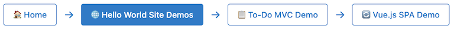

# jPulse Docs / Style Reference v1.3.0

Comprehensive CSS framework documentation for the jPulse `jp-*` styling system, providing consistent, responsive, and enterprise-ready components for web applications.

**🎯 Live Examples:** See the [Layout Examples](/jpulse-examples/layout.shtml) page for interactive demonstrations of responsive layouts, CSS Grid, Flexbox, and all styling components.

## 🎨 Overview

The jPulse CSS Component Library provides a complete set of pre-built components using the `jp-*` prefix convention. This system ensures consistent styling, responsive design, and easy maintenance across all jPulse applications.

### Design Principles
- **Consistent Naming**: All framework components use `jp-*` prefix
- **Responsive Design**: Mobile-first approach with flexible layouts
- **Enterprise Ready**: Professional styling suitable for business applications
- **Modular Architecture**: Components can be used independently or combined
- **Theme Support**: Built-in support for light/dark themes

### CSS Prefix Convention
- **`jp-*`** = Framework components (always in `jpulse-common.css`)
- **`local-*`** = Page-specific styles (always in current page's `<style>` section)
- **`site-*`** = Site-specific customizations (in site override files)

## 🏗️ Layout Components

### Containers

#### Basic Container
Responsive container with configurable max-width:

```css
.jp-container {
    max-width: 1200px;
    margin: 0 auto;
    padding: 0 1rem;
}
```

```html
<div class="jp-container">
    <h1>Page Content</h1>
    <p>Content automatically centered with responsive padding.</p>
</div>
```

#### Fixed-Width Containers
Containers with specific width constraints:

```css
.jp-container-400 { max-width: 400px; margin: 0 auto; }
.jp-container-600 { max-width: 600px; margin: 0 auto; }
.jp-container-800 { max-width: 800px; margin: 0 auto; }
.jp-container-1200 { max-width: 1200px; margin: 0 auto; }
```

```html
<!-- Login form container -->
<div class="jp-container-400">
    <form class="jp-form">
        <!-- Form content -->
    </form>
</div>

<!-- Article content -->
<div class="jp-container-800">
    <article>
        <!-- Article content -->
    </article>
</div>
```

#### Main Content Area
Primary content container with background and shadow:

```css
.jp-main {
    background: white;
    border-radius: 8px;
    box-shadow: 0 2px 8px rgba(0,0,0,0.1);
    padding: 2rem;
    margin: 2rem 0;
}
```

```html
<div class="jp-container">
    <main class="jp-main">
        <h1>Dashboard</h1>
        <p>Main application content goes here.</p>
    </main>
</div>
```

### Card Components

#### Basic Card
Reusable card component with optional dialog-style headings:

```css
.jp-card {
    background: white;
    border-radius: 8px;
    box-shadow: 0 2px 4px rgba(0,0,0,0.1);
    padding: 20px;
    margin-bottom: 25px;
}

.jp-card-dialog-heading {
    background: #f5f5f5;
    margin: -20px -20px 25px -20px;
    padding: 15px 20px;
    border-radius: 8px 8px 0 0;
    font-size: 1.25rem;
    font-weight: 600;
    color: #333;
}
```

```html
<!-- Simple card with dialog-style header -->
<div class="jp-card">
    <h2 class="jp-card-dialog-heading">User Profile</h2>
    <p>Profile information and settings.</p>
    <button class="jp-btn jp-btn-primary">Save Changes</button>
</div>

<!-- Card with subheading -->
<div class="jp-card">
    <h2 class="jp-card-dialog-heading">Settings</h2>
    <div class="jp-card-subheading">Configure your preferences</div>
    <p>Settings content goes here...</p>
</div>

<!-- Simple card without dialog header (regular h2) -->
<div class="jp-card">
    <h2>Simple Card Title</h2>
    <p>Card content goes here...</p>
</div>
```

#### Dashboard Cards
Special cards for dashboard layouts:

```css
.jp-card-dashboard {
    background: linear-gradient(to bottom, #f8f8f8 0%, #fbfbfb 40%, #fbfbfb 100%);
    border-radius: 8px;
    box-shadow: 0 2px 8px rgba(0,0,0,0.1);
    padding: 2rem;
    text-align: center;
    transition: transform 0.2s ease, box-shadow 0.2s ease;
    cursor: pointer;
}

.jp-card-dashboard:hover {
    transform: translateY(-2px);
    box-shadow: 0 4px 12px rgba(0,0,0,0.15);
}
```

```html
<div class="jp-dashboard-grid">
    <div class="jp-card-dashboard" onclick="location.href='/admin/users.shtml'">
        <div class="jp-icon-container">
            {{use.jpIcons.usersSvg size="64"}}
        </div>
        <h3>User Management</h3>
        <p>Manage user accounts and permissions</p>
    </div>
</div>
```

## 🎛️ UI Components

### Buttons

#### Button Variants
Complete button system with multiple variants:

```css
.jp-btn {
    display: inline-block;
    padding: 0.75rem 1.5rem;
    border: 1px solid transparent;
    border-radius: 4px;
    font-size: 1rem;
    font-weight: 500;
    text-align: center;
    text-decoration: none;
    cursor: pointer;
    transition: all 0.2s ease;
}

.jp-btn-primary {
    background-color: #007acc;
    border-color: #007acc;
    color: white;
}

.jp-btn-secondary {
    background-color: #6c757d;
    border-color: #6c757d;
    color: white;
}

.jp-btn-success {
    background-color: #28a745;
    border-color: #28a745;
    color: white;
}

.jp-btn-danger {
    background-color: #dc3545;
    border-color: #dc3545;
    color: white;
}

.jp-btn-outline {
    background-color: transparent;
    border-color: #007acc;
    color: #007acc;
}
```

```html
<!-- Button examples -->
<button class="jp-btn jp-btn-primary">Primary Action</button>
<button class="jp-btn jp-btn-secondary">Secondary</button>
<button class="jp-btn jp-btn-success">Success</button>
<button class="jp-btn jp-btn-danger">Delete</button>
<button class="jp-btn jp-btn-outline">Outline</button>
```

#### Button Groups
Grouped buttons with responsive stacking:

```css
.jp-btn-group {
    display: flex;
    gap: 0.5rem;
    flex-wrap: wrap;
}

.jp-btn-group .jp-btn {
    flex: 1;
    min-width: 120px;
}

@media (max-width: 768px) {
    .jp-btn-group {
        flex-direction: column;
    }

    .jp-btn-group .jp-btn {
        width: 100%;
    }
}
```

```html
<div class="jp-btn-group">
    <button class="jp-btn jp-btn-primary">Save</button>
    <button class="jp-btn jp-btn-secondary">Cancel</button>
    <button class="jp-btn jp-btn-outline">Preview</button>
</div>
```

#### Button Navigation Groups
Navigation-specific button group with arrows showing hierarchy:

```css
.jp-btn-nav-group {
    display: flex;
    gap: 10px;
    margin-bottom: 30px;
    border-bottom: 2px solid #e0e0e0;
    padding-bottom: 15px;
    flex-wrap: wrap;
    align-items: center;
}

.jp-btn-nav-group .jp-btn-active {
    background-color: #007acc;
    color: white;
    border-color: #007acc;
}

.jp-btn-nav-arrow {
    color: #007acc;
    font-size: 1.2em;
    user-select: none;
}
```

**Example with buttons:**
```html
<nav class="jp-btn-nav-group">
    <button class="jp-btn jp-btn-outline jp-btn-active">📋 Overview</button>
    <span class="jp-btn-nav-arrow">→</span>
    <button class="jp-btn jp-btn-outline">😀 Emoji Cursor</button>
    <span class="jp-btn-nav-arrow">→</span>
    <button class="jp-btn jp-btn-outline">✅ Collaborative Todo</button>
    <span class="jp-btn-nav-arrow">→</span>
    <button class="jp-btn jp-btn-outline">💻 Code Examples</button>
</nav>
```

**Example with links:**
```html
<nav class="jp-btn-nav-group">
    <a href="/" class="jp-btn jp-btn-outline">🏠 Home</a>
    <span class="jp-btn-nav-arrow">→</span>
    <a href="/hello/" class="jp-btn jp-btn-active">🌐 Hello World Site Demos</a>
    <span class="jp-btn-nav-arrow">→</span>
    <a href="/hello-todo/" class="jp-btn jp-btn-outline">📋 To-Do MVC Demo</a>
    <span class="jp-btn-nav-arrow">→</span>
    <a href="/hello-vue/" class="jp-btn jp-btn-outline">🔄 Vue.js SPA Demo</a>
</nav>
```

This example renders like this:



#### Loading States
Button loading states with spinner animation:

```css
.jp-btn-loading {
    position: relative;
    color: transparent !important;
}

.jp-btn-loading::after {
    content: '';
    position: absolute;
    top: 50%;
    left: 50%;
    transform: translate(-50%, -50%);
    width: 1rem;
    height: 1rem;
    border: 2px solid transparent;
    border-top: 2px solid currentColor;
    border-radius: 50%;
    animation: jp-spin 1s linear infinite;
}

@keyframes jp-spin {
    0% { transform: translate(-50%, -50%) rotate(0deg); }
    100% { transform: translate(-50%, -50%) rotate(360deg); }
}
```

```html
<button class="jp-btn jp-btn-primary jp-btn-loading">Processing...</button>
```

### Alert Components

#### Alert Variants
Message containers with different severity levels:

```css
.jp-alert {
    padding: 1rem 1.5rem;
    border-radius: 4px;
    border: 1px solid transparent;
    margin-bottom: 1rem;
}

.jp-alert-info {
    background-color: #d1ecf1;
    border-color: #bee5eb;
    color: #0c5460;
}

.jp-alert-success {
    background-color: #d4edda;
    border-color: #c3e6cb;
    color: #155724;
}

.jp-alert-warning {
    background-color: #fff3cd;
    border-color: #ffeaa7;
    color: #856404;
}

.jp-alert-error {
    background-color: #f8d7da;
    border-color: #f5c6cb;
    color: #721c24;
}
```

```html
<div class="jp-alert jp-alert-info">
    <strong>Info:</strong> Your session will expire in 5 minutes.
</div>

<div class="jp-alert jp-alert-success">
    <strong>Success:</strong> Profile updated successfully!
</div>

<div class="jp-alert jp-alert-warning">
    <strong>Warning:</strong> This action cannot be undone.
</div>

<div class="jp-alert jp-alert-error">
    <strong>Error:</strong> Please check your input and try again.
</div>
```

#### Info Boxes
Specialized message containers with colored borders:

```css
.jp-info-box {
    background-color: #f8f9fa;
    border-left: 4px solid #007acc;
    padding: 1rem;
    margin: 1rem 0;
}

.jp-warning-box {
    background-color: #fff8e1;
    border-left: 4px solid #ff9800;
    padding: 1rem;
    margin: 1rem 0;
}

.jp-error-box {
    background-color: #ffebee;
    border-left: 4px solid #f44336;
    padding: 1rem;
    margin: 1rem 0;
}
```

```html
<div class="jp-info-box">
    <h4>Information</h4>
    <p>This feature requires administrator privileges.</p>
</div>

<div class="jp-warning-box">
    <h4>Warning</h4>
    <p>Changes will be applied immediately and cannot be undone.</p>
</div>
```

## 👤 User Components

### User Information Display

#### User Info Container
Container for user profile display with avatar and details:

```css
.jp-user-info {
    display: flex;
    align-items: center;
    gap: 1rem;
    padding: 1rem;
    background: #f8f9fa;
    border-radius: 8px;
}

.jp-user-avatar {
    width: 32px;
    height: 32px;
    border-radius: 50%;
    background: linear-gradient(135deg, #667eea 0%, #764ba2 100%);
    display: flex;
    align-items: center;
    justify-content: center;
    color: white;
    font-weight: bold;
    font-size: 0.875rem;
}

.jp-user-avatar-large {
    width: 80px;
    height: 80px;
    font-size: 1.5rem;
}

.jp-user-details {
    flex: 1;
}

.jp-user-name {
    font-weight: 600;
    color: #333;
    margin: 0;
}

.jp-user-login {
    font-size: 0.875rem;
    color: #666;
    margin: 0;
}
```

```html
<div class="jp-user-info">
    <div class="jp-user-avatar">JS</div>
    <div class="jp-user-details">
        <div class="jp-user-name">John Smith</div>
        <div class="jp-user-login">jsmith</div>
    </div>
</div>

<!-- Large avatar for profile headers -->
<div class="jp-user-info">
    <div class="jp-user-avatar jp-user-avatar-large">JS</div>
    <div class="jp-user-details">
        <h2 class="jp-user-name">John Smith</h2>
        <p class="jp-user-login">jsmith@example.com</p>
    </div>
</div>
```

### Status and Role Indicators

#### Status Badges
Visual indicators for user status:

```css
.jp-status-badge {
    display: inline-block;
    padding: 0.25rem 0.5rem;
    border-radius: 12px;
    font-size: 0.75rem;
    font-weight: 600;
    text-transform: uppercase;
    letter-spacing: 0.5px;
}

.jp-status-active {
    background-color: #d4edda;
    color: #155724;
}

.jp-status-inactive {
    background-color: #f8d7da;
    color: #721c24;
}

.jp-status-pending {
    background-color: #fff3cd;
    color: #856404;
}

.jp-status-suspended {
    background-color: #e2e3e5;
    color: #383d41;
}
```

```html
<span class="jp-status-badge jp-status-active">Active</span>
<span class="jp-status-badge jp-status-pending">Pending</span>
<span class="jp-status-badge jp-status-suspended">Suspended</span>
```

#### Role Badges
Visual indicators for user roles:

```css
.jp-role-badge {
    display: inline-block;
    padding: 0.25rem 0.5rem;
    border-radius: 4px;
    font-size: 0.75rem;
    font-weight: 600;
    text-transform: uppercase;
}

.jp-role-root {
    background-color: #dc3545;
    color: white;
}

.jp-role-admin {
    background-color: #007acc;
    color: white;
}

.jp-role-user {
    background-color: #28a745;
    color: white;
}

.jp-role-guest {
    background-color: #6c757d;
    color: white;
}
```

```html
<span class="jp-role-badge jp-role-root">Root</span>
<span class="jp-role-badge jp-role-admin">Admin</span>
<span class="jp-role-badge jp-role-user">User</span>
<span class="jp-role-badge jp-role-guest">Guest</span>
```

### Action Components

#### Action Sections
Grouped actions with headers and separators:

```css
.jp-action-section {
    border-top: 1px solid #e9ecef;
    padding-top: 1.5rem;
    margin-top: 1.5rem;
}

.jp-action-section h4 {
    margin: 0 0 1rem 0;
    color: #495057;
    font-size: 1rem;
    font-weight: 600;
}

.jp-divider {
    display: flex;
    align-items: center;
    margin: 2rem 0;
    color: #6c757d;
    font-size: 0.875rem;
    font-weight: 500;
}

.jp-divider::before,
.jp-divider::after {
    content: '';
    flex: 1;
    height: 1px;
    background: #e9ecef;
}

.jp-divider::before {
    margin-right: 1rem;
}

.jp-divider::after {
    margin-left: 1rem;
}
```

```html
<div class="jp-action-section">
    <h4>Security Settings</h4>
    <div class="jp-btn-group">
        <button class="jp-btn jp-btn-primary">Change Password</button>
        <button class="jp-btn jp-btn-outline">Two-Factor Auth</button>
    </div>
</div>

<div class="jp-divider">Account Actions</div>

<div class="jp-action-section">
    <h4>Danger Zone</h4>
    <button class="jp-btn jp-btn-danger">Delete Account</button>
</div>
```

## 📝 Form Components

### Form Structure

#### Form Groups and Labels
Complete form styling with proper spacing and alignment:

```css
.jp-form {
    max-width: 600px;
}

.jp-form-group {
    margin-bottom: 1.5rem;
}

.jp-form-label {
    display: block;
    margin-bottom: 0.5rem;
    font-weight: 600;
    color: #495057;
}

.jp-form-input,
.jp-form-select,
.jp-form-textarea {
    display: block;
    width: 100%;
    padding: 0.75rem;
    border: 1px solid #ced4da;
    border-radius: 4px;
    font-size: 1rem;
    transition: border-color 0.15s ease-in-out, box-shadow 0.15s ease-in-out;
}

.jp-form-input:focus,
.jp-form-select:focus,
.jp-form-textarea:focus {
    outline: 0;
    border-color: #007acc;
    box-shadow: 0 0 0 0.2rem rgba(0, 122, 204, 0.25);
}
```

```html
<form class="jp-form">
    <div class="jp-form-group">
        <label class="jp-form-label" for="firstName">First Name</label>
        <input type="text" class="jp-form-input" id="firstName" name="firstName">
    </div>

    <div class="jp-form-group">
        <label class="jp-form-label" for="email">Email</label>
        <input type="email" class="jp-form-input" id="email" name="email">
    </div>

    <div class="jp-form-group">
        <label class="jp-form-label" for="role">Role</label>
        <select class="jp-form-select" id="role" name="role">
            <option value="user">User</option>
            <option value="admin">Admin</option>
        </select>
    </div>
</form>
```

#### Form Grid Layouts
Responsive form layouts with grid system:

```css
.jp-form-grid {
    display: grid;
    gap: 1rem;
    grid-template-columns: 1fr;
}

.jp-form-grid-2 {
    grid-template-columns: 1fr 1fr;
}

.jp-form-grid-3 {
    grid-template-columns: 1fr 1fr 1fr;
}

@media (max-width: 768px) {
    .jp-form-grid-2,
    .jp-form-grid-3 {
        grid-template-columns: 1fr;
    }
}
```

```html
<form class="jp-form">
    <div class="jp-form-grid jp-form-grid-2">
        <div class="jp-form-group">
            <label class="jp-form-label">First Name</label>
            <input type="text" class="jp-form-input">
        </div>
        <div class="jp-form-group">
            <label class="jp-form-label">Last Name</label>
            <input type="text" class="jp-form-input">
        </div>
    </div>
</form>
```

### Search Components

#### Search Sections
Specialized components for search interfaces:

```css
.jp-search-section {
    background: #f8f9fa;
    border-radius: 8px;
    padding: 1.5rem;
    margin-bottom: 2rem;
}

.jp-search-form {
    margin: 0;
}

.jp-search-fields {
    display: grid;
    gap: 1rem;
    grid-template-columns: repeat(auto-fit, minmax(200px, 1fr));
    margin-bottom: 1rem;
}

@media (max-width: 768px) {
    .jp-search-fields {
        grid-template-columns: 1fr;
    }
}
```

```html
<div class="jp-search-section">
    <h3>Search Users</h3>
    <form class="jp-search-form">
        <div class="jp-search-fields">
            <div class="jp-form-group">
                <label class="jp-form-label">Username</label>
                <input type="text" class="jp-form-input" placeholder="Search by username">
            </div>
            <div class="jp-form-group">
                <label class="jp-form-label">Role</label>
                <select class="jp-form-select">
                    <option value="">All Roles</option>
                    <option value="admin">Admin</option>
                    <option value="user">User</option>
                </select>
            </div>
            <div class="jp-form-group">
                <label class="jp-form-label">Status</label>
                <select class="jp-form-select">
                    <option value="">All Status</option>
                    <option value="active">Active</option>
                    <option value="inactive">Inactive</option>
                </select>
            </div>
        </div>
        <button type="submit" class="jp-btn jp-btn-primary">Search</button>
    </form>
</div>
```

### Error States

#### Field Error Styling
Error state styling for form validation:

```css
.jp-field-error {
    border-color: #dc3545 !important;
    box-shadow: 0 0 0 0.2rem rgba(220, 53, 69, 0.25) !important;
}

.jp-field-error-message {
    display: block;
    margin-top: 0.25rem;
    font-size: 0.875rem;
    color: #dc3545;
}
```

```html
<div class="jp-form-group">
    <label class="jp-form-label">Email</label>
    <input type="email" class="jp-form-input jp-field-error" value="invalid-email">
    <span class="jp-field-error-message">Please enter a valid email address</span>
</div>
```

## 🔧 Utility Classes

### Flexbox Utilities

#### Flex Containers and Alignment
Flexible layout utilities for common patterns:

```css
.jp-flex {
    display: flex;
}

.jp-flex-between {
    display: flex;
    justify-content: space-between;
    align-items: center;
}

.jp-flex-center {
    display: flex;
    justify-content: center;
    align-items: center;
}

.jp-flex-wrap {
    flex-wrap: wrap;
}

.jp-flex-column {
    flex-direction: column;
}
```

```html
<!-- Header with title and actions -->
<div class="jp-flex-between">
    <h1>Dashboard</h1>
    <div class="jp-btn-group">
        <button class="jp-btn jp-btn-primary">New User</button>
    </div>
</div>

<!-- Centered content -->
<div class="jp-flex-center" style="min-height: 200px;">
    <div class="jp-card">
        <p>Centered card content</p>
    </div>
</div>
```

### Spacing Utilities

#### Gap and Margin Utilities
Consistent spacing utilities for layouts:

```css
.jp-gap-10 { gap: 10px; }
.jp-gap-15 { gap: 15px; }
.jp-gap-20 { gap: 20px; }

.jp-mb-10 { margin-bottom: 10px; }
.jp-mb-15 { margin-bottom: 15px; }
.jp-mb-20 { margin-bottom: 20px; }
.jp-mb-30 { margin-bottom: 30px; }

.jp-mt-10 { margin-top: 10px; }
.jp-mt-15 { margin-top: 15px; }
.jp-mt-20 { margin-top: 20px; }
.jp-mt-30 { margin-top: 30px; }
```

```html
<div class="jp-flex jp-gap-15">
    <button class="jp-btn jp-btn-primary">Save</button>
    <button class="jp-btn jp-btn-secondary">Cancel</button>
</div>

<div class="jp-mb-20">
    <h2>Section Title</h2>
</div>
<div class="jp-mb-30">
    <p>Section content with proper spacing.</p>
</div>
```

### Visibility Utilities

#### Show/Hide Elements
Utility classes for element visibility:

```css
.jp-hidden {
    display: none !important;
}

.jp-visible {
    display: block !important;
}

.jp-invisible {
    visibility: hidden !important;
}
```

```html
<!-- Initially hidden content -->
<div id="advancedOptions" class="jp-hidden">
    <h4>Advanced Options</h4>
    <p>Additional configuration options.</p>
</div>

<button onclick="document.getElementById('advancedOptions').classList.toggle('jp-hidden')">
    Toggle Advanced Options
</button>
```

## 🏗️ Dashboard Components

### Dashboard Grid
Responsive grid system for dashboard layouts:

```css
.jp-dashboard-grid {
    display: grid;
    grid-template-columns: repeat(auto-fit, minmax(280px, 1fr));
    gap: 2rem;
    padding: 2rem 0;
}

@media (max-width: 768px) {
    .jp-dashboard-grid {
        grid-template-columns: 1fr;
        gap: 1rem;
        padding: 1rem 0;
    }
}
```

### Icon Containers
Standardized icon containers for dashboard cards:

```css
.jp-icon-container {
    width: 128px;
    height: 128px;
    background-color: #007acc;
    color: #ffffff;  /* Color inherited by inline SVG icons */
    border-radius: 8px;
    display: flex;
    align-items: center;
    justify-content: center;
    margin: 0 auto 1rem auto;
}

.jp-icon {
    width: 64px;
    height: 64px;
}
```

**Using SVG Icon Components (Recommended)**:

Icon components are automatically available in all pages (included via `jpulse-header.tmpl`):

```html
<div class="jp-dashboard-grid">
    <div class="jp-card-dashboard">
        <div class="jp-icon-container">
            {{use.jpIcons.usersSvg size="64"}}
        </div>
        <h3>User Management</h3>
        <p>Manage user accounts and permissions</p>
    </div>

    <div class="jp-card-dashboard">
        <div class="jp-icon-container">
            {{use.jpIcons.configSvg size="64"}}
        </div>
        <h3>Site Configuration</h3>
        <p>Configure application settings</p>
    </div>
</div>
```

**Benefits:**
- **Reusable**: Define once, use everywhere
- **Theme-ready**: Icons automatically use `currentColor` to inherit parent color
- **Maintainable**: Update icon in one place, changes reflect everywhere
- **Clean**: Concise `{{use.jpIcons.*}}` syntax instead of verbose SVG markup

**Alternative - Inline SVG** (for custom or one-off icons):
```html
<div class="jp-icon-container">
    <svg xmlns="http://www.w3.org/2000/svg" width="64" height="64" viewBox="0 0 24 24" fill="none" stroke="currentColor" stroke-width="2" class="jp-icon">
        <path d="M16 21v-2a4 4 0 0 0-4-4H6a4 4 0 0 0-4 4v2"/>
        <circle cx="9" cy="7" r="4"/>
        <path d="M22 21v-2a4 4 0 0 0-3-3.87"/>
        <path d="M16 3.13a4 4 0 0 1 0 7.75"/>
    </svg>
</div>
```

### SVG Icons in Headings
Professional SVG icons in page headings with proper vertical alignment:

```css
h1 svg, h2 svg, h3 svg, h4 svg, h5 svg, h6 svg {
    vertical-align: middle;
    margin-right: 8px;
}
```

**Usage**:
```html
<h1>
    <svg xmlns="http://www.w3.org/2000/svg" width="26" height="26" viewBox="0 0 24 24" fill="none" stroke="currentColor" stroke-width="2">
        <path d="M16 21v-2a4 4 0 0 0-4-4H6a4 4 0 0 0-4 4v2"/>
        <circle cx="9" cy="7" r="4"/>
        <path d="M22 21v-2a4 4 0 0 0-3-3.87"/>
        <path d="M16 3.13a4 4 0 0 1 0 7.75"/>
    </svg>
    User Management
</h1>
```

**Key Points**:
- Use `vertical-align: middle` to align SVG icons with text baseline
- Inline SVGs inherit `currentColor` from parent heading
- Icons should be sized appropriately for the heading level (e.g., 26px for h1, 22px for h2)
- Theme-ready: Icons automatically adapt to text color

## 🎨 Collapsible Components

### Collapsible Sections
CSS for collapsible content sections (works with jPulse JavaScript):

```css
.jp-collapsible {
    border: 1px solid #e9ecef;
    border-radius: 8px;
    margin-bottom: 1rem;
}

.jp-collapsible-header {
    background: #f8f9fa;
    padding: 1rem 1.5rem;
    cursor: pointer;
    display: flex;
    justify-content: space-between;
    align-items: center;
    border-bottom: 1px solid #e9ecef;
}

.jp-collapsible-header:hover {
    background: #e9ecef;
}

.jp-collapsible-content {
    padding: 1.5rem;
    display: none; /* Initially hidden, controlled by JavaScript */
}

.jp-collapsible-content.jp-expanded {
    display: block;
}

.jp-collapsible-arrow {
    transition: transform 0.2s ease;
}

.jp-collapsible-arrow.jp-expanded {
    transform: rotate(90deg);
}
```

```html
<div id="securitySection" class="jp-collapsible">
    <div class="jp-collapsible-header">
        <h4>Security Settings</h4>
        <span class="jp-collapsible-arrow">▶</span>
    </div>
    <div class="jp-collapsible-content">
        <div class="jp-form-group">
            <label class="jp-form-label">Current Password</label>
            <input type="password" class="jp-form-input">
        </div>
        <div class="jp-form-group">
            <label class="jp-form-label">New Password</label>
            <input type="password" class="jp-form-input">
        </div>
    </div>
</div>
```

## 🌙 Theme System

### Theme Support
Built-in support for light and dark themes:

```css
/* Light theme (default) */
:root {
    --jp-bg-primary: #ffffff;
    --jp-bg-secondary: #f8f9fa;
    --jp-text-primary: #212529;
    --jp-text-secondary: #6c757d;
    --jp-border-color: #e9ecef;
}

/* Dark theme */
[data-theme="dark"] {
    --jp-bg-primary: #2d3748;
    --jp-bg-secondary: #4a5568;
    --jp-text-primary: #f7fafc;
    --jp-text-secondary: #cbd5e0;
    --jp-border-color: #4a5568;
}

/* Components using theme variables */
.jp-card {
    background: var(--jp-bg-primary);
    color: var(--jp-text-primary);
    border-color: var(--jp-border-color);
}

.jp-main {
    background: var(--jp-bg-primary);
    color: var(--jp-text-primary);
}
```

### Theme Implementation
```html
<!-- Theme toggle example -->
<button onclick="toggleTheme()" class="jp-btn jp-btn-outline">
    Toggle Theme
</button>

<script>
function toggleTheme() {
    const currentTheme = document.documentElement.getAttribute('data-theme');
    const newTheme = currentTheme === 'dark' ? 'light' : 'dark';
    document.documentElement.setAttribute('data-theme', newTheme);

    // Save preference
    jPulse.cookies.set('theme', newTheme, 365);
}

// Load saved theme
const savedTheme = jPulse.cookies.get('theme') || 'light';
document.documentElement.setAttribute('data-theme', savedTheme);
</script>
```

## 📱 Responsive Design

### Breakpoints
Standard responsive breakpoints used throughout the framework:

```css
/* Mobile first approach */
@media (min-width: 576px) {
    /* Small devices (landscape phones) */
}

@media (min-width: 768px) {
    /* Medium devices (tablets) */
}

@media (min-width: 992px) {
    /* Large devices (desktops) */
}

@media (min-width: 1200px) {
    /* Extra large devices (large desktops) */
}
```

### Responsive Utilities
Classes for responsive behavior:

```css
.jp-mobile-only {
    display: block;
}

.jp-desktop-only {
    display: none;
}

@media (min-width: 768px) {
    .jp-mobile-only {
        display: none;
    }

    .jp-desktop-only {
        display: block;
    }
}
```

## 🚀 Usage Examples

### Complete Page Layout
Example of a complete page using jPulse components:

```html
<!DOCTYPE html>
<html lang="en">
<head>
    <meta charset="UTF-8">
    <meta name="viewport" content="width=device-width, initial-scale=1.0">
    <title>User Management - jPulse Framework</title>
    <link rel="stylesheet" href="/jpulse-common.css">
</head>
<body>
    <div class="jp-container">
        <!-- Page Header -->
        <div class="jp-flex-between jp-mb-30">
            <h1>User Management</h1>
            <button class="jp-btn jp-btn-primary">Add New User</button>
        </div>

        <!-- Search Section -->
        <div class="jp-search-section">
            <h3>Search Users</h3>
            <form class="jp-search-form">
                <div class="jp-search-fields">
                    <div class="jp-form-group">
                        <label class="jp-form-label">Username</label>
                        <input type="text" class="jp-form-input" placeholder="Search by username">
                    </div>
                    <div class="jp-form-group">
                        <label class="jp-form-label">Role</label>
                        <select class="jp-form-select">
                            <option value="">All Roles</option>
                            <option value="admin">Admin</option>
                            <option value="user">User</option>
                        </select>
                    </div>
                </div>
                <button type="submit" class="jp-btn jp-btn-primary">Search</button>
            </form>
        </div>

        <!-- Results Section -->
        <div class="jp-main">
            <h2>Search Results</h2>

            <!-- User Cards -->
            <div class="jp-flex jp-gap-20 jp-flex-wrap">
                <div class="jp-card" style="flex: 1; min-width: 300px;">
                    <div class="jp-user-info">
                        <div class="jp-user-avatar">JS</div>
                        <div class="jp-user-details">
                            <div class="jp-user-name">John Smith</div>
                                <div class="jp-user-login">jsmith</div>
                            </div>
                            <div>
                                <span class="jp-role-badge jp-role-admin">Admin</span>
                                <span class="jp-status-badge jp-status-active">Active</span>
                            </div>
                        </div>
                    </div>

                    <div class="jp-action-section">
                            <div class="jp-btn-group">
                                <button class="jp-btn jp-btn-outline">Edit</button>
                                <button class="jp-btn jp-btn-danger">Delete</button>
                            </div>
                        </div>
                    </div>
                </div>
            </div>
        </div>
    </div>
</body>
</html>
```

### Form with Validation
Complete form example with error states:

```html
<div class="jp-container-600">
    <div class="jp-main">
        <h1>User Profile</h1>

        <form class="jp-form" id="profileForm">
            <div class="jp-form-grid jp-form-grid-2">
                <div class="jp-form-group">
                    <label class="jp-form-label">First Name</label>
                    <input type="text" class="jp-form-input" name="firstName" required>
                </div>
                <div class="jp-form-group">
                    <label class="jp-form-label">Last Name</label>
                    <input type="text" class="jp-form-input" name="lastName" required>
                </div>
            </div>

            <div class="jp-form-group">
                <label class="jp-form-label">Email</label>
                <input type="email" class="jp-form-input jp-field-error" name="email" value="invalid-email">
                <span class="jp-field-error-message">Please enter a valid email address</span>
            </div>

            <!-- Collapsible Security Section -->
            <div id="securitySection" class="jp-collapsible">
                <div class="jp-collapsible-header">
                    <h4>Security Settings</h4>
                    <span class="jp-collapsible-arrow">▶</span>
                </div>
                <div class="jp-collapsible-content">
                    <div class="jp-form-group">
                        <label class="jp-form-label">Current Password</label>
                        <input type="password" class="jp-form-input" name="currentPassword">
                    </div>
                    <div class="jp-form-group">
                        <label class="jp-form-label">New Password</label>
                        <input type="password" class="jp-form-input" name="newPassword">
                    </div>
                </div>
            </div>

            <div class="jp-btn-group jp-mt-30">
                <button type="submit" class="jp-btn jp-btn-primary">Save Changes</button>
                <button type="button" class="jp-btn jp-btn-secondary">Cancel</button>
            </div>
        </form>
    </div>
</div>
```

---

**jPulse Style Reference** - Consistent, responsive, and enterprise-ready styling. 🎨
